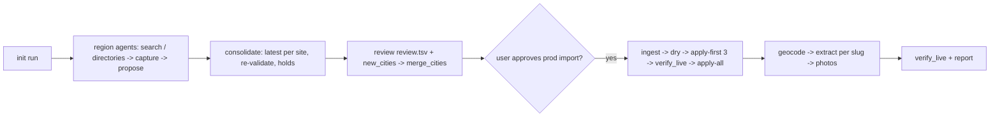

# Fetch gyms

Grow the FightGyms directory region by region from gyms' own websites. Every stored fact (name,
street address, city, state, disciplines) is backed by a verbatim quote from the gym's official site,
captured with real timestamps and redirect provenance, and validated by `scrapers/public_candidates.py`
before it can reach production. Google Places content is never stored.



## Setup

Scripts live in `scripts/` and run with the main checkout's venv, which `common.py` finds through git
(worktrees have no `scrapers/.env` or `.venv`). Each run gets a private directory
`~/.local/share/fightgyms/runs/<run>/` holding `run.json`, `captures/`, `leads/`, `final/`,
`holds.json` and `queue.sqlite3`. Keep it: it is the audit trail, never commit it.

```bash
PY=<main checkout>/scrapers/.venv/bin/python
S=<repo>/.claude/skills/fetch-gyms/scripts
$PY $S/kit.py --run new-england-2026-10 init --states MA,RI --city-file MA=new-england.txt --city-file RI=new-england.txt
```

`init` writes `run.json`, an empty `holds.json`, and `existing_gyms.txt` (live gyms for dedupe,
read-only query). For a state with no region list yet, the list file is created at merge time. For a
state whose printed name (e.g. "Massachusetts") is not yet in `STATE_NAMES` in
`scrapers/public_candidates.py`, add it with a test first.

## Discovery

1. Split the region into 4–6 areas of similar size and launch one background agent per area in a
   single message (Agent tool). Give each the output of
   `kit.py --run R brief --region <slug> --areas "<towns / neighbourhoods>"` plus an explicit
   WebSearch budget: the 200-call cap is per session and shared (about 25 each for six agents).
2. While agents run, answer nothing on their behalf; read their final reports. Each lists valid /
   incomplete / skipped gyms and reviewer notes (stale site, kids-only or cardio evidence, moved,
   conflicting addresses, coming soon). Turn those notes into `holds.json` entries:
   `{"hosts": {"example.com": "reason"}, "urls": {"https://example.com/location-page": "reason"}}`.

## Consolidate and review

```bash
$PY $S/consolidate.py --run R          # final/candidates.jsonl, review.tsv, dropped.tsv, new_cities.txt
```

- Read `final/review.tsv`: fitness franchises, kickboxing-only rows at karate schools, odd addresses.
  Hold anything doubtful; re-run consolidate after editing `holds.json`.
- Read `final/new_cities.txt`: each line must be a real postal city as the gym prints it. Then
  `$PY $S/merge_cities.py --run R` appends them to the region lists (`run.json` city_files) and a
  re-run of consolidate must report `new_cities: 0`.
- Consolidation re-proposes every lead from its captures with the current rules, keeps the latest
  decision per site, never lets an `out_of_area` skip override another region's proposal, and sets
  a single-location gym's website to its homepage.

## Import (production: explicit user approval first)

Ask the user before the first production write and state the count. Then:

```bash
$PY $S/importer.py --run R ingest        # private queue, 50 per call
$PY $S/importer.py --run R dry
$PY $S/importer.py --run R apply-first 3
$PY $S/verify_live.py --run R --sample 3 # rows + live gym and city pages, before going on
$PY $S/importer.py --run R apply-all     # 5 new gyms per transaction until nothing is pending
```

`ambiguous_location` review rows are expected for a brand's second location on the same website;
report them, do not retry them. If a queue must be rebuilt, rename the old file (never delete it) and
ingest into a fresh `queue.sqlite3`.

## Enrich and verify

```bash
$PY $S/enrich.py --run R geocode --dry-run && $PY $S/enrich.py --run R geocode
$PY $S/enrich.py --run R extract --workers 4   # prices, schedules, coaches (Haiku); per --gym-slug
$PY $S/enrich.py --run R photos                # own-site photos only, vision-filtered, 4 gyms at a time
$PY $S/enrich.py --run R phones --dry-run && $PY $S/enrich.py --run R phones   # from the captured pages
$PY $S/enrich.py --run R socials [--scrapers <checkout>/scrapers]           # fetch_photos --socials-only per gym
$PY $S/verify_live.py --run R --sample 6
```

The importer stores no phone. `phones` takes the number printed on the gym's own captured pages, but only
when there is one distinct number, or one number beside the gym's street address across all its pages. It
skips toll-free, fax and placeholder numbers, fills only empty phones, and writes a provenance row (page, printed
text, text hash). Read `final/phones.tsv` from the dry run before writing.

Report per region: imported, held (with reasons), in review, coverage gaps (areas that ran out of
search budget), and anything the user must deploy (web changes go out through the Vercel CLI).

## References

- `references/agent-brief.md`: the discovery brief (`kit.py brief` fills it in).
- `references/gotchas.md`: search cap, evidence-format pitfalls, hold criteria, post-import steps.
  Read it before starting a run.
- Code changes to `scrapers/public_candidates.py` need `python -m unittest discover -s scrapers/tests`;
  the importer's apply path can be exercised against a PGlite copy of the schema before production.
