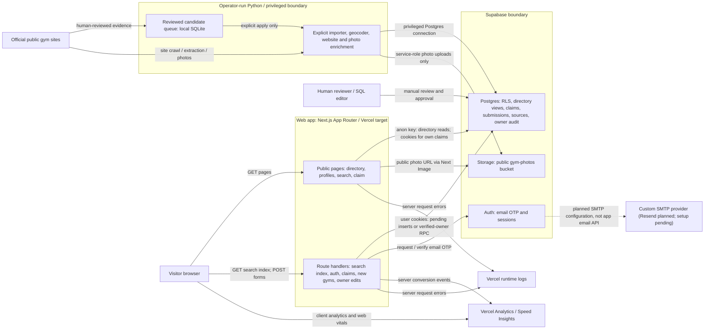

# Application architecture

This is a high-level map of the **checked-in implementation** at the time of writing, not a claim that every integration is configured or operating in production. The Next.js app is intended to run on Vercel; the Python ingestion tools are separate operator-run workflows, not web requests or an automatically scheduled worker.

**Legend and trust boundary.** Solid arrows describe code paths or documented operator actions; the dashed arrow is **planned account configuration**, not a confirmed live mail integration. The web app uses the **public anon key**, including server rendering and cookie-backed signed-in route handlers. It never needs an ingestion/service-role key: Postgres RLS restricts visitor reads/writes and user-owned claims/submissions; a narrow authenticated-only RPC publishes owner edits after locking and rechecking the exact verified claim. Separately, ingestion uses an explicitly supplied privileged Postgres connection; photo uploads use a server-side service-role credential. The photo bucket is public-read. Do not put scraper credentials or service-role keys in the browser or Vercel public env.

## Main flows and evidence

| Flow | Checked-in evidence |
| --- | --- |
| Public directory, gym detail, search, and SEO | [`web/src/lib/data.ts`](../web/src/lib/data.ts) (`getAllGyms`, `getGym` and the public anon client); [`web/src/app/gyms/[state]/[city]/page.tsx`](../web/src/app/gyms/%5Bstate%5D/%5Bcity%5D/page.tsx), [`web/src/app/gym/[slug]/page.tsx`](../web/src/app/gym/%5Bslug%5D/page.tsx) (`revalidate = 3600`); [`web/src/components/SiteSearch.tsx`](../web/src/components/SiteSearch.tsx) (browser fetches search index), [`web/src/app/api/search-index/route.ts`](../web/src/app/api/search-index/route.ts), [`web/src/app/search/page.tsx`](../web/src/app/search/page.tsx), [`web/src/app/sitemap.ts`](../web/src/app/sitemap.ts) and [`web/src/lib/site.ts`](../web/src/lib/site.ts). Search is built from public gym/place rows, not a separate search service. |
| Identity, owner editing, claims and new-gym submissions | [`web/src/app/claim/page.tsx`](../web/src/app/claim/page.tsx), [`web/src/app/api/auth/link/route.ts`](../web/src/app/api/auth/link/route.ts), [`web/src/app/auth/confirm/route.ts`](../web/src/app/auth/confirm/route.ts), [`web/src/lib/auth.ts`](../web/src/lib/auth.ts) and [`web/src/proxy.ts`](../web/src/proxy.ts) (cookie-backed Supabase Auth); [`web/src/app/api/owner-edit/route.ts`](../web/src/app/api/owner-edit/route.ts), [`web/src/app/api/submissions/gym/route.ts`](../web/src/app/api/submissions/gym/route.ts), [`web/src/app/api/claims/route.ts`](../web/src/app/api/claims/route.ts). Claims/new gyms insert **pending** rows. Verified claimants publish bounded listing details and prices immediately through `edit_owned_gym`, with atomic database audit/provenance. Public corrections are retired (`/api/submissions` returns 410); historical submissions remain. |
| Database and image policy | [`supabase/migrations/0001_init.sql`](../supabase/migrations/0001_init.sql) (directory tables, `gym_cards` / `gym_current_prices` views, RLS); [`0002_photos.sql`](../supabase/migrations/0002_photos.sql) (public bucket and claimant policies); [`0003_gym_cards_v3.sql`](../supabase/migrations/0003_gym_cards_v3.sql) (card fields); [`0004_submissions_policy.sql`](../supabase/migrations/0004_submissions_policy.sql) and [`0005_claims.sql`](../supabase/migrations/0005_claims.sql) (pending-only writes, own-row claims and reviewer views); [`0006_socials.sql`](../supabase/migrations/0006_socials.sql) (public social links); [`0007_owner_edits.sql`](../supabase/migrations/0007_owner_edits.sql) (verified-owner RPC, append-only private audit, deterministic price history and correction retirement; apply before deploying the editor). Image URLs come from [`web/src/lib/format.ts`](../web/src/lib/format.ts); **claimant photo upload UI is not implemented**. |
| Ingestion and review | [`scrapers/public_candidates.py`](../scrapers/public_candidates.py) (reviewed input, private SQLite queue, offline dry-run by default, explicit privileged `--apply`); [`scrapers/geocode_census.py`](../scrapers/geocode_census.py), [`scrapers/extract_site.py`](../scrapers/extract_site.py), [`scrapers/fetch_photos.py`](../scrapers/fetch_photos.py), [`scrapers/common/db.py`](../scrapers/common/db.py) (Postgres facts and provenance) and [`scrapers/common/storage.py`](../scrapers/common/storage.py) (service-role Storage upload). Reviewer approval/manual application is described in [`docs/launch-operations.md`](launch-operations.md#gym-claims), not implemented as an admin UI. Optional Jev triage is a disabled-by-default **shadow report**, not a publishing gate ([`docs/jev-shadow-triage.md`](jev-shadow-triage.md)). |
| Observability and deployment target | [`web/src/app/layout.tsx`](../web/src/app/layout.tsx) and [`web/src/lib/analytics.ts`](../web/src/lib/analytics.ts) mount client SDKs and send server conversion events only on Vercel; [`web/src/instrumentation.ts`](../web/src/instrumentation.ts) writes structured errors for runtime logs. [`docs/launch-operations.md`](launch-operations.md#scope-and-current-gates) documents the Vercel `web/` root and dashboard enablement gates; it is operational configuration, not deployment proof. |

## Scope and status

- `LIVE_STYLES` currently exposes Muay Thai and kickboxing; other styles may exist in the schema but their directory pages are gated ([`web/src/lib/types.ts`](../web/src/lib/types.ts)). With no Supabase configuration, the production app fails closed to unavailable/noindex; `SHOW_SAMPLE=1` is a non-production fictional demo only ([`web/src/lib/site.ts`](../web/src/lib/site.ts), [`web/src/lib/data.ts`](../web/src/lib/data.ts)).
- Claim/magic-link handlers and migration policies exist, **but a working external sign-in/claim path is not established by code alone**. Supabase email templates, redirect allow-list, migration application and custom SMTP remain operational gates ([`docs/launch-operations.md`](launch-operations.md#gym-claims)). Resend is planned as a provider for **Supabase Auth's custom SMTP**, not a direct Next.js-to-Resend call; its configuration and delivery have not been verified here.
- Vercel Analytics / Speed Insights need dashboard enablement, and runtime error logging does not imply a configured drain or alert ([`docs/launch-operations.md`](launch-operations.md#scope-and-current-gates)). The reviewed queue is local; recurring discovery is a documented contract, **not a verified active schedule**. Fighter enrichment and claimant photo uploads remain future work. No live service, mail delivery, database state, or deployment was checked for this diagram.
