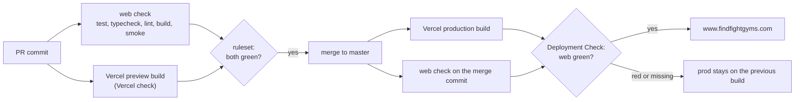

# Launch and discovery operations

## Scope and current gates

Canonical domain: **https://findfightgyms.com**. Product name: FightGyms.

The launch slice does not depend on Jev. It provides safe SEO behavior and a public-source candidate queue/importer. Code checks are not proof of a live deployment or database connection.

- Configure the Vercel project from repository `vnguyendc/fightgyms`, production branch `master`, **Root Directory `web`** (without it every git-triggered build fails with "Couldn't find any `pages` or `app` directory"; set 2026-09-27). Node is pinned by `engines.node` (24.x) in `web/package.json`, which overrides the project's Node setting; CI reads the same value.
- Set `NEXT_PUBLIC_SITE_URL=https://www.findfightgyms.com` (production canonical host is www; apex 308s to it), `NEXT_PUBLIC_SUPABASE_URL`, and the **public anon** `NEXT_PUBLIC_SUPABASE_ANON_KEY`. Never expose a service-role key to the browser.
- Leave `SHOW_SAMPLE` unset/`0`. Verify the existing schema and public-read RLS with actual data before publishing.
- Apply `supabase/migrations/0003_gym_cards_v3.sql` (`cd scrapers && .venv/bin/python run_sql.py ../supabase/migrations/0003_gym_cards_v3.sql`) before deploying a build that reads `trial_cents`/`class_count`. Older rows render as missing data, not errors. Rollback is re-running the view definition in `0002_photos.sql`; never drop data.
- Apply migrations through `0007_owner_edits.sql` in order **before deploying the owner editor UI**. 0007 adds the atomic owner-edit RPC and private audit, orders same-day prices deterministically, and replaces the correction INSERT policy with authenticated `new_gym` inserts only. Keep these restrictions during an app rollback; never restore the permissive 0001 policy. Until the new app deploys, any old correction forms will fail closed.
- Turn on **Web Analytics** and **Speed Insights** in the Vercel project (Analytics tab → Enable; Speed Insights tab → Enable). The code is already mounted; without the toggles the `/_vercel/insights` and `/_vercel/speed-insights` scripts 404 harmlessly and nothing is recorded. Page views, referrers, and Core Web Vitals per route appear there; the `owner_edit_published` event appears under Analytics → Events after a successful owner edit (price-field count only, no user-entered values). The old `correction_submitted` event is retired.
- Monitoring: server errors log as one JSON line with `"event":"request_error"` in Runtime Logs (Project → Logs, filter `request_error`, or Observability → Errors). Each carries the route, method, path, and an error `digest`; the public error page shows the same digest as `Reference …`, so a user's screenshot can be matched to the log line. Consider a Log Drain or a Vercel notification rule on error-rate before real traffic; none is configured by this repo.
- Attach the purchased domain and verify HTTPS and the preferred apex/www redirect. No DNS or domain change is implied by this document.
- Without a configured real backend, production intentionally shows an unavailable state, noindex, no fictional detail routes, and an empty sitemap. That state is **not an SEO launch**.

See [web checks](../web/tests/README.md) for commands and environment behavior.

## Deploy pipeline and checks



- **PRs.** GitHub ruleset `master: deploy checks` requires `web` (workflow `Web quality gates`, from GitHub Actions) and `Vercel` (the preview build of `web/`). Repo admins can bypass explicitly (merge-box checkbox or `gh pr merge --admin`), which also covers direct pushes to master. Previews have no Supabase env and render the unavailable state: proof the app builds, not that data renders.
- **master commits.** Vercel builds production right away; the Deployment Check `web` (Project → Settings → Build and Deployment → Deployment Checks) holds the production domains until the `web` run on that commit passes, for up to 30 minutes. A red or missing run leaves production on the previous build; Force Promote on the deployment page overrides it.
- `web` runs on every PR and master commit (no path filter) because both gates wait for it. Renaming the job breaks both gates: update the ruleset and the Deployment Check in the same change.
- **Manual.** Production ships from master. `vercel rollback` and `vercel promote <deployment-url>` switch production without a rebuild and still work from `web/`. `vercel deploy` from `web/` fails (it looks for `web/web`); if a CLI deploy is ever needed, run `vercel link` once at the repo root and deploy from there. Never `vercel --prod` from a feature branch: on 2026-09-26 a CLI deploy of an unmerged branch with uncommitted changes replaced production, and `/gyms/all` returned 404 while it was on master.

## Candidate pipeline

Discovery uses public official gym websites, not copied Google Maps/Places ratings or reviews. Scope is the region city lists in `scrapers/cities/*.txt` (DMV, NYC, NJ, PA) and the public Muay Thai/kickboxing disciplines; a city joins its region list by review before its candidates can ingest. Do not invent prices, schedules, fighters, or credentials. The current importer writes only supported public identity/location/discipline metadata; it does not refresh existing gym fields or run the credential-dependent fact extractor.

```bash
# Repository root; use the project Python 3.12 environment.
.venv/bin/python -m scrapers.public_candidates --help
.venv/bin/python -m scrapers.public_candidates ingest \
  --input /private/candidates.jsonl --queue /private/candidates.sqlite3
.venv/bin/python -m scrapers.public_candidates run \
  --queue /private/candidates.sqlite3
.venv/bin/python -m scrapers.public_candidates status \
  --queue /private/candidates.sqlite3
```

`ingest` writes only the private local queue. `run` is an offline dry-run by default. A production import requires an explicitly authorized apply command and a securely exported `DATABASE_URL`:

```bash
.venv/bin/python -m scrapers.public_candidates run \
  --queue /private/candidates.sqlite3 --apply --max-new 3
```

Do not use `--apply` in unattended discovery until the real database contract has been checked on the intended FightGyms instance. The importer uses short table-locking transactions and requires appropriate Postgres permissions. Existing gyms are preserved; ambiguous matches are held for review rather than overwritten. That includes a second location of a brand on the same website: the first location imports, the rest wait for a person.

After an apply, imported gyms still lack coordinates and site facts:

```bash
cd scrapers
python geocode_census.py --dry-run && python geocode_census.py   # lat/lng where null; census geocoder, public domain
python extract_site.py --gym-slug <slug>                          # per new gym: the importer's provenance row
                                                                  # makes the default selection skip it for 30 days
python fetch_photos.py --public-only --limit 200                  # never-attempted gyms, so new ones by default
```

## Evidence contract

The CLI help contains the exact JSONL schema. Every candidate must be a reviewed, official, public, single-location source with real fetch timestamps, redirect provenance, and verbatim supporting quotations.

- Each quote must exist in the captured source text and retain the complete assertion context. Never crop away a negation or contrary qualification.
- Location evidence requires street address, city and state (two-letter code or printed state name) in one quote, which may wrap over up to three lines of one address block. The country is US by scope and need not be printed; most gym sites print "518 5th Ave, Brooklyn, NY 11215". Official location-specific JSON-LD can provide this evidence. Missing evidence means skip/review, not invent or rewrite a quote.
- Do not include Google reviews, personal testimonials, secret values, private pages, or unrelated source material.
- Excerpts are acceptable only after inspecting the source context; keep the raw capture private for audit. Store no raw corpus in Git.
- Synthetic fixtures remain marked synthetic and cannot publish.
- Evidence expires after 30 days. Queue capacity and per-run caps are enforced; stopped/partial runs are not successful full coverage.

## Recurring discovery contract

Intended first operating mode is **discovery-only**: at most four search queries, eight official-site fetches, and three new candidates per daily run. Honor robots directives and rate limits; skip blocked pages instead of bypassing them. Rotate through the existing DMV city list, retain actual source timestamps, ingest valid candidates, and read back queue status. No database apply, Vercel changes, secret lookup, model-provider changes, or git pushes belong in that job.

A schedule is active only when its exact job record has been created and verified; this document alone does not enable automation.

## Initial SEO work

1. Launch actual sourced gym profiles and populated city/discipline pages; no empty programmatic location inventory.
2. Verify the public homepage, a city page, a gym page, robots.txt, and sitemap.xml after deployment. Confirm canonical URLs, HTTPS, real content, and expected indexing directives.
3. Verify the domain in the owner's Google Search Console account and submit the live sitemap. Search Console access and indexing are separate from Vercel deployment.
4. Measure impressions, indexed pages, search queries, and useful outbound gym-site visits before expanding geography or generating editorial pages.

There is no guarantee of rankings or traffic merely from deploying a sitemap. No Search Console submission, ranking, or traffic result is claimed here.

## Gym claims

Owners sign in by magic link, claim a listing, and submit missing gyms. Claims and new gym submissions start `pending`; only the reviewer verifies ownership. Verified claimants can publish bounded listing edits directly. Gates before this works for anyone outside the Supabase project team:

1. **Custom SMTP.** The built-in sender delivers 2 messages per hour and refuses addresses outside the project team. Configure a provider (Resend, Postmark or SES) with a findfightgyms.com sender and its DNS records under Authentication → SMTP settings. The default limit then becomes 30 emails per hour; raise it under Rate Limits if claims outpace it.
2. **Email provider and production templates.** Email sign-in must be enabled. The checked-in [magic-link template](../supabase/templates/magic-link.html) and [signup confirmation template](../supabase/templates/confirmation.html) pin `/auth/confirm` to `https://www.findfightgyms.com`; a stale `.SiteURL` cannot change that link host. Both templates pass `.RedirectTo` as the claim destination. These files do not update hosted settings. A release operator must separately install both in Authentication → Email Templates and verify their saved contents. Do not use these production templates for local development.
3. **URL Configuration and app origin.** Production Site URL and `NEXT_PUBLIC_SITE_URL` must both be `https://www.findfightgyms.com`. Redirect URLs must allow `https://www.findfightgyms.com/claim*` so `/claim` and `/claim?gym=<slug>` survive. Keep the production allowlist limited to the intended production paths; previews refuse sign-in. If Supabase substitutes its Site URL because the redirect is not allowed, the pinned template still verifies on production, but selected-gym context is lost. The app refuses production auth with missing, localhost, apex or foreign site configuration; auth response redirects also use the explicit public origin instead of request/forwarded hosts.

   Local `next dev` accepts only HTTP loopback request origins (localhost, 127.0.0.1 or ::1, including the port). Use a separate local/development Supabase project with [local-auth.html](../supabase/templates/local-auth.html) for both email templates, Site URL equal to that exact loopback origin, and a matching `/claim*` redirect allowlist. Do not point local development at the production project's pinned templates. Local cookies are HttpOnly/SameSite=Lax/Path=/ without Secure; production adds Secure. Preview sign-in is intentionally unavailable.

4. **Migration 0005.** First confirm `select count(*) from submissions where entity_id is null` is 0 (the shape constraint needs it), then `cd scrapers && .venv/bin/python run_sql.py ../supabase/migrations/0005_claims.sql`. It rewrites the 0004 insert policy with `new_gym` added, hardens `claims` (users insert pending rows for themselves only; status is reviewer-only) and adds `claim_review` / `submission_review` for the SQL editor. If the Data API reports an unknown column afterwards, run `notify pgrst, 'reload schema'`. Rollback is reverting the app; keep the policies.
5. **Migration 0007 before UI deployment.** After 0001–0006, apply `supabase/migrations/0007_owner_edits.sql` to the intended database using the normal release procedure, then deploy the app. The migration is transactional. This worktree has only exercised it in PGlite; no hosted migration, deployment, or email send was performed.

The editor lives at `/claim?gym=<slug>#edit`, with links from verified entries under "Your claims". A signed-in user without a verified claim sees no editor. `POST /api/owner-edit` uses the visitor's token, a strict bounded form/JSON schema, an 8 KiB streamed body limit and exact-origin CSRF validation. The `edit_owned_gym(text,jsonb)` RPC is executable only by `authenticated`; it derives the actor with `auth.uid()`, locks and checks a verified claim for the exact active, non-sample gym, validates the allowlist again, and writes listing fields, price history, sources and audit in one transaction. Revocation uses the same claim-before-gym lock order. No UPDATE policy on `gyms` is added.

Editable fields: name (160), street address (240), HTTPS website (500), phone (40), description (2,000), and trial/drop-in/monthly USD prices up to $1,000. Only trial may be zero. Slug, city/state, styles, coordinates, claim status, badges and actor attribution are not accepted from the form. Prices have keep/replace/withdraw actions; replacement resets old contract notes, withdrawal appends a null current price, and neither deletes history. Street-address changes clear stale coordinates (also recorded in the audit); run the existing geocoder separately when ready. Schedules, photos and other price kinds are outside this editor's scope.

`gym_owner_edits` is private and append-only (before/after, gym, database-derived actor, claim, source and timestamp). `sources.kind='gym_claim'` retains the raw edit and attribution; appended prices point to that source. Public profiles disclose owner-supplied facts are not independently checked, even if a claim is later revoked. Successful app edits invalidate directory pages and the search-index cache for their next visit. If cache invalidation fails after commit, the redirect explicitly reports that changes were saved but public refresh may take up to an hour; `owner_edit_cache_failed` records that failure without user data. Direct SQL or direct RPC writes bypass Next cache invalidation and follow the usual hourly refresh unless separately invalidated.

Public correction UI and its prompts are removed. `POST /api/submissions` always returns 410; direct correction INSERTs are denied to both anon and authenticated clients. Historical `submissions`, own-history reads and `submission_review` remain. `/api/submissions/gym` remains a signed-in, manually reviewed new-gym path.

Diagnosis and release gates for the 2026-10-07 auth fix:

- The sign-in form posts the selected slug to `/api/auth/link`. The handler sends `signInWithOtp` with an absolute `/claim?gym=<slug>` destination. Supabase's saved template, not `emailRedirectTo` alone, determines the verification link's outer host. The old documented template used `.SiteURL` there, so a localhost Site URL is consistent with the reported symptom. The actual hosted Site URL, allowlist and saved templates were not inspected; the live root cause is not confirmed. See Supabase's [template variables](https://supabase.com/docs/guides/auth/auth-email-templates) and [redirect configuration](https://supabase.com/docs/guides/auth/redirect-urls).
- `/auth/confirm` canonicalizes an alias callback before consuming its one-use token, so the session cookie is set by the public host. It then verifies the token hash with Supabase and accepts only `/claim` or `/claim?gym=<slug>` on that origin. Expired/malformed links retain safe gym context for retry; external or ambiguous destinations are dropped. `/claim` verifies identity from the session and offers a pending claim for the selected gym. Signing in does not verify ownership.
- The unpushed `700933e` was inspected via `git show` only. This branch independently extends its approach to canonical response redirects, preview refusal, failed-link gym context, and separate local templates. The other worktree was not modified or cherry-picked.
- **Unverified account gates:** hosted templates (both new and existing account emails), Site URL, redirect allowlist, email provider enablement, signup/confirmation options, OTP expiry/rate limits, SMTP sender/provider/DNS/delivery, production app environment, and which migrations are applied. Nothing in this task changes dashboard, DNS, SMTP or the live database.
- **Unverified live E2E:** a newly requested email to an explicitly approved recipient; correct verification host and selected gym in new-account and returning-account emails; browser cookie persistence, reload/refresh and signout on the canonical host; expired/reused link behavior; pending claim and missing-gym rows with actual hosted RLS; manual reviewer verification. No approved recipient was provided, so no emails were sent. Inspect only host/path and outcomes; never copy/log full magic links, tokens or cookies. Local tests are not deployment or production proof.

Review, as postgres in the SQL editor:

- Claim: `select * from claim_review where status = 'pending'`; `domain_match` is true when the sign-in email's domain equals the gym's website host. `update claims set status = 'verified' where id = '<id>'` (or `'rejected'`). The trigger flips `gyms.claimed`; cards and profiles follow within the hour.
- New gym: `select * from submission_review where field = 'new_gym' and status = 'pending'`. Create the gym through the normal path with a `sources` row `kind = 'user_submit'` whose `raw` is the submission's `proposed_value`, then `update submissions set status = 'approved' where id = '<id>'`. Only after separately verifying ownership by hand, when the role was owner, manager or coach, `insert into claims (entity_type, entity_id, user_id, status, role, contact_email) values ('gym', '<gym id>', '<submitted_by>', 'verified', '<role>', '<contact_email>')`.
- Historical corrections remain in `submission_review`. Review those rows through the existing sourced publishing procedure; new public corrections cannot be filed. Inspect owner edit history with `select * from gym_owner_edits order by created_at desc` as the database reviewer.
- From 2026-10-30 new tables in `public` are not exposed to the Data API by default; grant explicitly when one is added. 0005 adds none.
- `claim_submitted`, `gym_submitted`, and `owner_edit_published` are the current conversion events; `correction_submitted` is historical.

## Verification and rollback

- Python: `.venv/bin/python -m unittest discover -s scrapers/tests -v`.
- Web: `cd web && npm test && npm run typecheck && npm run lint && npm run build && npm run test:smoke` (smoke expects an unconfigured production build; do not use it as live-data proof).
- Roll back the app if needed while retaining 0007 and historical data. Old correction requests remain denied. To suspend owner edits without deleting anything, revoke `execute` on `public.edit_owned_gym(text,jsonb)` from `authenticated`; restore that grant only after the issue is resolved. Claim verification remains manual.
- A real public Kaizen MMA Fairfax source was captured and accepted into the local queue, then dry-run successfully with zero database inserts. This is candidate-path verification, not confirmation the gym is absent from the existing database or published on the site.
- 2026-09-27, first production import (NYC, NJ, PA, DMV; run `northeast-2026-09` via `.claude/skills/fetch-gyms`). 593 sites were checked, 199 candidates validated after 10 reviewer holds, and 186 were inserted in 38 committed transactions. 13 went to review as `ambiguous_location`: a brand's second location on the same website, or the same name in the same city. The census geocoder located 173. Sampled gym and city pages returned 200 with indexable metadata. The apply path had first been exercised against a PGlite copy of the schema loaded with the live gyms.
- Stop a discovery schedule through Hermes cron controls. Keep queued evidence for audit; do not delete published rows as a rollback shortcut.

References: [Google scaled-content policy](https://developers.google.com/search/docs/essentials/spam-policies), [Places API policies](https://developers.google.com/maps/documentation/places/web-service/policies).
