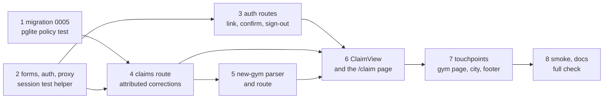

# Gym Claims and New-Gym Submissions Implementation Plan

> **For agentic workers:** REQUIRED SUB-SKILL: Use superpowers:subagent-driven-development (recommended) or superpowers:executing-plans to implement this plan task-by-task. Steps use checkbox (`- [ ]`) syntax for tracking.

**Goal:** Let a gym owner sign in by magic link, claim a listed gym (pending until the reviewer verifies it, then the "✓ claimed" badge), have their corrections attributed to them, and submit a gym that is not listed yet; nothing publishes without review.

**Architecture:** Supabase Auth magic links with `@supabase/ssr` cookie sessions. A `proxy.ts` matched to `/claim` only refreshes tokens for the one server component that reads them; every other auth-aware path is a route handler that reads the request's cookies and writes refreshed cookies onto its own 303 redirect. All writes are inserts performed as the signed-in user through the public anon key, so migration `0005_claims.sql`'s row-level security (pending rows only, own user id only, status is reviewer-only) is the real boundary. Plain HTML forms, no client-side Supabase, no service-role key in the web app.

**Tech Stack:** Next.js 16.3.5 app router (params/searchParams are Promises; `PageProps<'/route'>` is global after `next typegen`; middleware is `src/proxy.ts`), React 19, Tailwind v4, `@supabase/supabase-js` ^2.116 + `@supabase/ssr` 0.12.7, Postgres via Supabase, `node:test` through `npm test` (each test file is its own process; Supabase HTTP is stubbed with `t.mock.method(globalThis, "fetch", …)`), `@electric-sql/pglite` 0.5.8 for the migration test, Python `scrapers/run_sql.py` to apply migrations live (the user's call, not part of this plan).

**Spec:** `docs/superpowers/specs/2026-09-26-gym-claims-design.md` (read it first; every task argues from it).

## Task map



Tasks 1 and 2 are independent; everything else follows the arrows. Each task ends green and committed.

## Global Constraints

- Work in the worktree `/Users/vinhnguyen/projects/fightgyms/.claude/worktrees/gym-claim-submit-flow-96f4c9` on branch `claude/gym-claim-submit-flow-96f4c9` (based on master after PRs #3, #4, #5). `web/node_modules` is installed there. Ignored files (`web/.env.local`, `scrapers/.env`) exist only in the main checkout `/Users/vinhnguyen/projects/fightgyms`; never needed by this plan.
- Never invent data for real gyms. No claim or submission changes directory tables; only the reviewer does, by hand.
- Never delete rows. `is_active=false` is the only removal.
- `LIVE_STYLES` stays `["muay_thai", "kickboxing"]`. Submitted mma/bjj gyms are stored, not listed.
- Directory pages stay static under `export const revalidate = 3600`. Auth code (`lib/auth.ts`, `proxy.ts`, `next/headers`) is imported only by `/claim`, route handlers and the proxy. Never by `GymCard`, `GymPhoto`, `GymList`, `SortControl`, `SiteSearch` or any client component.
- The browser key is the public anon/publishable key in `NEXT_PUBLIC_SUPABASE_ANON_KEY`. No new environment variables. No service-role key anywhere in `web/`.
- Cookie options on every Supabase server client: `{ httpOnly: true, sameSite: "lax", secure: process.env.NODE_ENV === "production", path: "/" }` (the library defaults to `httpOnly: false`).
- Next 16: a POST that redirects returns a 303. `Response.redirect()` has immutable headers, so any redirect that must carry `Set-Cookie` is built with `new Response(null, { status: 303, headers })`.
- Route handlers outside live mode (`runtimePolicy().mode !== "live"`) return 503 for POST and redirect without cookies for GET, and never contact Supabase. Demo mode (`SHOW_SAMPLE=1`) counts as not live.
- Copy rules: `/claim` on an unconfigured build must still contain "not available yet" and no `<form`. Live gym profiles must not contain "not available yet". Never promise editing, photo upload or premium in copy.
- Migration numbering: `0005_claims.sql`. 0004 is live and stays untouched. 0005 creates no new tables (Data API exposure rules), only columns, constraints, policies, triggers and two reviewer-only views.
- Tests use `node:test` and `renderToStaticMarkup`, fixtures from `web/tests/fixtures.ts`, `t.mock.method(globalThis, "fetch", …)` for Supabase, and never contact a real project. Client components must not use `useRouter`/`useSearchParams`.
- The full check must be green before every commit that touches `web/`: `cd web && npm test && npm run typecheck && npm run lint`. Before the PR also `npm run build && npm run test:smoke` with `NEXT_PUBLIC_SUPABASE_URL` and `NEXT_PUBLIC_SUPABASE_ANON_KEY` unset.
- Commit messages: lowercase, terse, one line, then a blank line and `Co-Authored-By: Claude Fable 5.1 <noreply@anthropic.com>`.
- Pin new packages exactly (`@supabase/ssr@0.12.7`, `@electric-sql/pglite@0.5.8`) and commit `package-lock.json`.
- Read `web/node_modules/next/dist/docs/01-app/03-api-reference/03-file-conventions/route.md` and `proxy.md` before writing a route or the proxy.

## Review Focus

1. **A `next` value that is protocol-relative (`//evil.test/claim`), carries a hash, or adds a second query key** must fall back to `/claim`, never redirect off-site. Pinned in Task 2 (`auth.test.ts`, `claimNext` table).
2. **A session cookie that is garbage, expired with a revoked refresh token, or valid-looking but rejected by Supabase** must render `/claim` signed out and make `POST /api/claims` answer `error=signin`, never a 500 or a bogus insert. Pinned in Task 4 (`claims.test.ts`, 401 from `/auth/v1/user`) and Task 6 (`routes-missing.test.tsx`, page renders signed out when `cookies()` is unavailable).
3. **A magic link clicked twice**: the second `verifyOtp` fails, so the confirm route must redirect to `error=auth` with no `Set-Cookie`. Pinned in Task 3 (`auth-routes.test.ts`).
4. **New-gym form abuse**: four styles, duplicate styles, lowercase `va`, an address without a street number, a 2 KB note, an `@handle` with uppercase. Each is normalized or rejected by field, never inserted raw. Pinned in Task 5 (`newgym.test.ts` parser table).
5. **A signed-in correction whose cookie is malformed** must degrade to an anonymous insert through the anon client (0004 forbids a forged `submitted_by`), never fail the correction. Pinned in Task 4 (`submissions.test.ts`).

## File Structure

New files, one responsibility each:

- `supabase/migrations/0005_claims.sql` — claims columns, constraints, unique index, policies, three triggers; submissions policy v2, shape constraint, stamp trigger; two reviewer-only views.
- `web/tests/migrations.test.ts` — runs 0001–0005 + seed on PGlite with stubbed `auth`/`storage` and asserts the policies as `authenticated` and the triggers as postgres.
- `web/src/lib/forms.ts` — `readBody(request)`, `MAX_BODY`, `tooLarge(request)`, `str(v)`; shared by every POST route (moved out of the submissions route).
- `web/src/lib/auth.ts` — server-only: cookie options, `requestClient(request)`, `pageClient()`, `userOf(client)`, `currentUser()`, `redirectWith(url, cookies)`, `sameOrigin(request)`, `claimNext(next)`, `SLUG`.
- `web/src/proxy.ts` — refreshes the session on `/claim` only.
- `web/src/app/api/auth/link/route.ts`, `web/src/app/auth/confirm/route.ts`, `web/src/app/api/auth/signout/route.ts` — the three auth handlers.
- `web/src/lib/analytics.ts` — `recordEvent(name, props, request)` (moved from the submissions route; `correction_submitted` keeps its shape).
- `web/src/lib/claims.ts` — `parseClaim(body)`, `insertClaim(client, input)`, `listOwnClaims(client)`, `listOwnSubmissions(client)`, row types.
- `web/src/app/api/claims/route.ts` — files a pending claim as the signed-in user.
- `web/src/app/api/submissions/gym/route.ts` — files a `new_gym` submission as the signed-in user; `parseNewGym` and `insertNewGym` live in `lib/submissions.ts` next to the correction parser.
- `web/src/components/ClaimView.tsx` — pure server component rendering every `/claim` state from props; the page only resolves state.
- Tests: `web/tests/auth.test.ts` (helpers + proxy), `web/tests/auth-routes.test.ts`, `web/tests/claims.test.ts`, `web/tests/newgym.test.ts`, plus extensions to `submissions.test.ts`, `routes-live.test.tsx`, `routes-missing.test.tsx`, `smoke.mjs`.

Modified: `web/src/app/api/submissions/route.ts` (shared helpers, session attribution, analytics import), `web/src/lib/submissions.ts` (session-aware insert, new-gym parser), `web/src/lib/data.ts` (`getGymCardsByIds`), `web/src/app/claim/page.tsx` (state resolution), `web/src/app/gym/[slug]/page.tsx` (claim panel), `web/src/components/CityPage.tsx` (submit line), `web/src/app/layout.tsx` (footer text), `web/package.json`, `web/package-lock.json`, `docs/launch-operations.md`, `CLAUDE.md`, `web/tests/README.md`.

---

### Task 1: Migration `0005_claims.sql` and the PGlite policy test

**Files:**
- Create: `supabase/migrations/0005_claims.sql`
- Create: `web/tests/migrations.test.ts`
- Modify: `web/package.json` (devDependencies)

**Interfaces:**
- Produces: `claims` columns `role`, `note`, `contact_email`, `website_host`, `domain_match`, `reviewed_at`, `updated_at`; policies `claims_select_own`, `claims_insert_pending`; triggers `claims_stamp`, `claims_touch`, `claims_sync_gym`; `submissions_insert_any` v2 allowing `field = 'new_gym'` with `entity_id is null` and `submitted_by = auth.uid()`; check `submissions_new_gym_shape`; trigger `submissions_stamp`; views `claim_review`, `submission_review`. Later tasks insert exactly `{ entity_type: 'gym', entity_id, user_id, role, note, status: 'pending', plan: 'free' }` into `claims` and `{ entity_type: 'gym', entity_id: null, field: 'new_gym', proposed_value, note, submitted_by, contact_email, status: 'pending' }` into `submissions`.

- [ ] **Step 1: Add the PGlite devDependency**

```bash
cd /Users/vinhnguyen/projects/fightgyms/.claude/worktrees/gym-claim-submit-flow-96f4c9/web && npm install --save-dev --save-exact --no-audit --no-fund @electric-sql/pglite@0.5.8 && grep -n pglite package.json
```

Expected: `"@electric-sql/pglite": "0.5.8"` under devDependencies and `package-lock.json` updated.

- [ ] **Step 2: Write the failing migration test**

`web/tests/migrations.test.ts`:

```ts
import assert from "node:assert/strict";
import { readFileSync } from "node:fs";
import { join } from "node:path";
import { test } from "node:test";
import { PGlite } from "@electric-sql/pglite";
import { pg_trgm } from "@electric-sql/pglite/contrib/pg_trgm";
import { pgcrypto } from "@electric-sql/pglite/contrib/pgcrypto";

// Runs the real migration chain on an in-process Postgres with the Supabase-managed schemas stubbed.
// Policies are exercised as the `authenticated` role with a fake JWT in request.jwt.claims, the way PostgREST sets it.
const root = join(import.meta.dirname, "..", "..");
const sql = (file: string) => readFileSync(join(root, "supabase", file), "utf8");
const OWNER = "00000000-0000-4000-8000-000000000001";
const OTHER = "00000000-0000-4000-8000-000000000002";

async function boot() {
  const db = new PGlite({ extensions: { pg_trgm, pgcrypto } });
  await db.exec(`
    create role anon nologin; create role authenticated nologin; create role service_role nologin;
    create schema auth;
    create table auth.users (id uuid primary key, email text);
    create function auth.uid() returns uuid language sql stable as $$
      select coalesce(nullif(current_setting('request.jwt.claim.sub', true), ''),
                      nullif(current_setting('request.jwt.claims', true), '')::jsonb ->> 'sub')::uuid $$;
    create function auth.jwt() returns jsonb language sql stable as $$
      select coalesce(nullif(current_setting('request.jwt.claims', true), ''), '{}')::jsonb $$;
    create schema storage;
    create table storage.buckets (id text primary key, name text, public bool, file_size_limit bigint, allowed_mime_types text[]);
    create table storage.objects (id uuid primary key default gen_random_uuid(), bucket_id text, name text);
    create function storage.foldername(name text) returns text[] language sql immutable as $$ select string_to_array(name, '/') $$;
    grant usage on schema public to anon, authenticated;
  `);
  for (const f of ["migrations/0001_init.sql", "migrations/0002_photos.sql", "migrations/0003_gym_cards_v3.sql", "migrations/0004_submissions_policy.sql", "migrations/0005_claims.sql", "seed.sql"]) {
    await db.exec(sql(f));
  }
  await db.exec(`
    grant select, insert, update, delete on all tables in schema public to anon, authenticated;
    insert into auth.users (id, email) values ('${OWNER}', 'owner@siamstrike.example'), ('${OTHER}', 'other@example.com');
    insert into places (state, city, slug) values ('VA', 'Reston', 'reston-va');
    insert into gyms (slug, name, styles, place_id, website, is_sample) values
      ('real-gym-reston-va', 'Real Gym', '{muay_thai}', (select id from places where slug = 'reston-va'), 'https://www.SiamStrike.example/', false),
      ('real-no-site-reston-va', 'No Site Gym', '{kickboxing}', (select id from places where slug = 'reston-va'), null, false);
  `);
  return db;
}

/** Run one statement as `role` with the given JWT claims, then drop back to the superuser. */
async function as<T>(db: PGlite, role: "anon" | "authenticated", claims: Record<string, string> | null, query: string, params: unknown[] = []) {
  await db.exec(`set role ${role}`);
  await db.query("select set_config('request.jwt.claims', $1, false)", [claims ? JSON.stringify(claims) : ""]);
  try {
    return await db.query<T>(query, params);
  } finally {
    await db.exec("reset role");
  }
}

const owner = { sub: OWNER, email: "owner@siamstrike.example", role: "authenticated" };
const other = { sub: OTHER, email: "other@example.com", role: "authenticated" };
const gymId = async (db: PGlite, slug: string) => (await db.query<{ id: string }>("select id from gyms where slug = $1", [slug])).rows[0].id;

test("migration chain applies and 0005 adds the claim columns, views and policies", async () => {
  const db = await boot();
  const cols = (await db.query<{ column_name: string }>("select column_name from information_schema.columns where table_name = 'claims' order by 1")).rows.map((r) => r.column_name);
  for (const c of ["role", "note", "contact_email", "website_host", "domain_match", "reviewed_at", "updated_at"]) assert.ok(cols.includes(c), c);
  const policies = (await db.query<{ policyname: string }>("select policyname from pg_policies where tablename = 'claims' order by 1")).rows.map((r) => r.policyname);
  assert.deepEqual(policies, ["claims_insert_pending", "claims_select_own"]);
  const views = (await db.query<{ table_name: string }>("select table_name from information_schema.views where table_schema = 'public' and table_name in ('claim_review', 'submission_review') order by 1")).rows.map((r) => r.table_name);
  assert.deepEqual(views, ["claim_review", "submission_review"]);
  await db.close();
});

test("a signed-in user can file exactly one pending claim per gym, for themselves, on a live non-sample gym", async () => {
  const db = await boot();
  const gym = await gymId(db, "real-gym-reston-va");
  const sample = await gymId(db, "sample-siam-strike-arlington-va");
  const insert = "insert into claims (entity_type, entity_id, user_id, role, note, status, plan) values ('gym', $1, $2, 'owner', $3, $4, 'free')";
  await as(db, "authenticated", owner, insert, [gym, OWNER, "head coach here", "pending"]);
  await assert.rejects(as(db, "authenticated", owner, insert, [gym, OWNER, null, "verified"]), /row-level security/, "verified on insert");
  await assert.rejects(as(db, "authenticated", owner, insert, [gym, OTHER, null, "pending"]), /row-level security/, "another user's id");
  await assert.rejects(as(db, "authenticated", owner, insert, [sample, OWNER, null, "pending"]), /row-level security/, "sample gym");
  await assert.rejects(as(db, "authenticated", owner, insert, [gym, OWNER, null, "pending"]), /claims_open_per_user_gym|duplicate key/, "second open claim");
  await assert.rejects(as(db, "anon", null, insert, [gym, OWNER, null, "pending"]), /row-level security/, "anonymous");
  await assert.rejects(as(db, "authenticated", owner, "update claims set status = 'verified' where user_id = $1", [OWNER]).then(async () => {
    const { rows } = await db.query<{ status: string }>("select status from claims where user_id = $1", [OWNER]);
    if (rows[0].status !== "pending") throw new Error("status changed");
    throw new Error("row-level security update refused silently");
  }), /row-level security/, "users cannot update");
  const own = await as<{ status: string; contact_email: string; website_host: string; domain_match: boolean }>(db, "authenticated", owner, "select status, contact_email, website_host, domain_match from claims");
  assert.deepEqual(own.rows, [{ status: "pending", contact_email: "owner@siamstrike.example", website_host: "siamstrike.example", domain_match: true }]);
  const theirs = await as(db, "authenticated", other, "select id from claims");
  assert.equal(theirs.rows.length, 0, "select is own rows only");
  await db.close();
});

test("the reviewer's status change syncs gyms.claimed, stamps reviewed_at, and a rejected owner can re-file", async () => {
  const db = await boot();
  const gym = await gymId(db, "real-gym-reston-va");
  const noSite = await gymId(db, "real-no-site-reston-va");
  await as(db, "authenticated", owner, "insert into claims (entity_type, entity_id, user_id, role, status, plan) values ('gym', $1, $2, 'owner', 'pending', 'free')", [gym, OWNER]);
  await as(db, "authenticated", other, "insert into claims (entity_type, entity_id, user_id, role, status, plan) values ('gym', $1, $2, 'coach', 'pending', 'free')", [noSite, OTHER]);
  const claimed = async (id: string) => (await db.query<{ claimed: boolean }>("select claimed from gyms where id = $1", [id])).rows[0].claimed;
  assert.equal(await claimed(gym), false, "pending never flips the flag");
  await db.query("update claims set status = 'verified' where entity_id = $1", [gym]);
  assert.equal(await claimed(gym), true);
  const row = (await db.query<{ reviewed_at: string | null; updated_at: string }>("select reviewed_at, updated_at from claims where entity_id = $1", [gym])).rows[0];
  assert.ok(row.reviewed_at, "reviewed_at stamped");
  await db.query("update claims set status = 'rejected' where entity_id = $1", [gym]);
  assert.equal(await claimed(gym), false, "revoking the only verified claim clears the flag");
  await as(db, "authenticated", owner, "insert into claims (entity_type, entity_id, user_id, role, status, plan) values ('gym', $1, $2, 'owner', 'pending', 'free')", [gym, OWNER]);
  const noSiteRow = (await db.query<{ website_host: string | null; domain_match: boolean }>("select website_host, domain_match from claims where entity_id = $1", [noSite])).rows[0];
  assert.deepEqual(noSiteRow, { website_host: null, domain_match: false });
  const review = await db.query<{ gym_slug: string; status: string }>("select gym_slug, status from claim_review order by gym_slug");
  assert.deepEqual(review.rows.map((r) => r.gym_slug), ["real-gym-reston-va", "real-gym-reston-va", "real-no-site-reston-va"]);
  await db.close();
});

test("submissions: 0004 rules still hold, new_gym needs a signed-in submitter and no entity, contact email is stamped", async () => {
  const db = await boot();
  const gym = await gymId(db, "real-gym-reston-va");
  const correction = "insert into submissions (entity_type, entity_id, field, proposed_value, note, contact_email, submitted_by, status) values ('gym', $1, $2, $3::jsonb, $4, $5, $6, 'pending')";
  await as(db, "anon", null, correction, [gym, "trial_price", '{"value":"$20","cents":2000}', null, "tip@example.com", null]);
  await assert.rejects(as(db, "anon", null, correction, [gym, "trial_price", '{"value":"$20"}', null, null, OWNER]), /row-level security/, "anon cannot forge submitted_by");
  await assert.rejects(as(db, "authenticated", other, correction, [gym, "trial_price", '{"value":"$20"}', null, null, OWNER]), /row-level security/, "another user's id");
  await assert.rejects(as(db, "authenticated", owner, correction, [gym, "google_rating", '{"value":"5"}', null, null, OWNER]), /row-level security/, "unknown field");
  const newGym = "insert into submissions (entity_type, entity_id, field, proposed_value, note, contact_email, submitted_by, status) values ('gym', $1, 'new_gym', $2::jsonb, $3, null, $4, 'pending')";
  await assert.rejects(as(db, "anon", null, newGym, [null, '{"name":"X"}', null, null]), /row-level security/, "anonymous new gym");
  await assert.rejects(as(db, "authenticated", owner, newGym, [gym, '{"name":"X"}', null, OWNER]), /submissions_new_gym_shape|row-level security/, "new gym with an entity");
  await as(db, "authenticated", owner, newGym, [null, '{"name":"X","city":"Reston","state":"VA"}', "we opened in march", OWNER]);
  await as(db, "authenticated", owner, correction, [gym, "website", '{"value":"https://siamstrike.example"}', null, "typed@example.com", OWNER]);
  const rows = (await db.query<{ field: string; contact_email: string | null; submitted_by: string | null }>("select field, contact_email, submitted_by from submissions order by created_at, field")).rows;
  assert.deepEqual(rows.filter((r) => r.field !== "trial_price"), [
    { field: "new_gym", contact_email: "owner@siamstrike.example", submitted_by: OWNER },
    { field: "website", contact_email: "owner@siamstrike.example", submitted_by: OWNER },
  ], "signed-in rows carry the jwt email, whatever the form sent");
  assert.deepEqual(rows.find((r) => r.field === "trial_price"), { field: "trial_price", contact_email: "tip@example.com", submitted_by: null });
  await db.query("update claims set status = 'verified' where id in (select id from claims)");
  await as(db, "authenticated", owner, "insert into claims (entity_type, entity_id, user_id, role, status, plan) values ('gym', $1, $2, 'owner', 'pending', 'free')", [gym, OWNER]);
  await db.query("update claims set status = 'verified' where user_id = $1", [OWNER]);
  const review = (await db.query<{ field: string; from_verified_claimant: boolean }>("select field, from_verified_claimant from submission_review order by field")).rows;
  assert.deepEqual(review, [{ field: "new_gym", from_verified_claimant: false }, { field: "trial_price", from_verified_claimant: false }, { field: "website", from_verified_claimant: true }]);
  await db.close();
});
```

- [ ] **Step 3: Run the test to verify it fails**

Run: `cd web && node --import tsx --test tests/migrations.test.ts`
Expected: FAIL in `boot()` with `ENOENT … 0005_claims.sql`.

- [ ] **Step 4: Write the migration**

`supabase/migrations/0005_claims.sql`:

```sql
-- fightgyms: gym claims
-- claims: a signed-in user inserts pending rows for themselves only; the reviewer sets status as postgres.
-- submissions: 0004's policy plus the new_gym field (signed-in submitter, no entity) and a shape check.
-- no new tables. run with: cd scrapers && .venv/bin/python run_sql.py ../supabase/migrations/0005_claims.sql

alter table claims
  add column if not exists role          text,
  add column if not exists note          text,
  add column if not exists contact_email text,
  add column if not exists website_host  text,
  add column if not exists domain_match  bool not null default false,
  add column if not exists reviewed_at   timestamptz,
  add column if not exists updated_at    timestamptz default now();

alter table claims drop constraint if exists claims_status_check;
alter table claims add constraint claims_status_check check (status in ('pending', 'verified', 'rejected'));
alter table claims drop constraint if exists claims_plan_check;
alter table claims add constraint claims_plan_check check (plan in ('free', 'premium'));
alter table claims drop constraint if exists claims_role_check;
alter table claims add constraint claims_role_check check (role is null or role in ('owner', 'manager', 'coach', 'other'));
alter table claims drop constraint if exists claims_note_check;
alter table claims add constraint claims_note_check check (note is null or length(note) <= 1000);
-- one open claim per user per gym; a rejected owner can file again
create unique index if not exists claims_open_per_user_gym on claims (entity_type, entity_id, user_id) where status <> 'rejected';

-- rls: own rows to read, pending own rows to insert, nothing else for users
drop policy if exists claims_own on claims;
drop policy if exists claims_select_own on claims;
create policy claims_select_own on claims
  for select to authenticated using (user_id = (select auth.uid()));
drop policy if exists claims_insert_pending on claims;
create policy claims_insert_pending on claims
  for insert to authenticated with check (
    user_id = (select auth.uid())
    and status = 'pending' and plan = 'free' and entity_type = 'gym' and reviewed_at is null
    and exists (select 1 from gyms g where g.id = entity_id and g.is_active and not g.is_sample)
  );

-- stamp the verified email and the domain hint; the form never supplies contact_email for signed-in inserts
create or replace function claims_stamp() returns trigger language plpgsql set search_path = public as $$
begin
  if auth.uid() is not null then
    new.contact_email := auth.jwt() ->> 'email';
  end if;
  select lower(regexp_replace(substring(g.website from '^[A-Za-z]+://([^/:?#]+)'), '^www\.', ''))
    into new.website_host from gyms g where g.id = new.entity_id;
  new.domain_match := new.website_host is not null and new.contact_email is not null
    and lower(split_part(new.contact_email, '@', 2)) = new.website_host;
  return new;
end $$;
drop trigger if exists claims_stamp on claims;
create trigger claims_stamp before insert on claims for each row execute function claims_stamp();

create or replace function claims_touch() returns trigger language plpgsql set search_path = public as $$
begin
  new.updated_at := now();
  if new.status is distinct from old.status then new.reviewed_at := now(); end if;
  return new;
end $$;
drop trigger if exists claims_touch on claims;
create trigger claims_touch before update on claims for each row execute function claims_touch();

-- gyms.claimed follows verified claims; a pending insert never touches gyms
create or replace function claims_sync_gym() returns trigger language plpgsql set search_path = public as $$
begin
  if new.status = 'verified' or (tg_op = 'UPDATE' and old.status = 'verified') then
    update gyms set claimed = exists (
      select 1 from claims c where c.entity_type = 'gym' and c.entity_id = new.entity_id and c.status = 'verified'
    ) where id = new.entity_id;
  end if;
  return new;
end $$;
drop trigger if exists claims_sync_gym on claims;
create trigger claims_sync_gym after insert or update of status on claims for each row execute function claims_sync_gym();

-- submissions: 0004's policy with new_gym added
drop policy if exists submissions_insert_any on submissions;
create policy submissions_insert_any on submissions
  for insert with check (
    status = 'pending'
    and entity_type = 'gym'
    and field in ('trial_price', 'drop_in_price', 'monthly_price', 'website', 'other', 'new_gym')
    and (submitted_by is null or submitted_by = auth.uid())
    and (field <> 'new_gym' or (submitted_by is not null and entity_id is null))
    and coalesce(length(note), 0) <= 1000
    and coalesce(length(contact_email), 0) <= 254
    and pg_column_size(proposed_value) <= 4096
  );
alter table submissions drop constraint if exists submissions_new_gym_shape;
alter table submissions add constraint submissions_new_gym_shape check ((field = 'new_gym') = (entity_id is null));

create or replace function submissions_stamp() returns trigger language plpgsql set search_path = public as $$
begin
  if auth.uid() is not null then
    new.contact_email := auth.jwt() ->> 'email';
  end if;
  return new;
end $$;
drop trigger if exists submissions_stamp on submissions;
create trigger submissions_stamp before insert on submissions for each row execute function submissions_stamp();

-- reviewer views: security invoker, not for the data api
create or replace view claim_review with (security_invoker = true) as
select c.*, g.slug as gym_slug, g.name as gym_name, g.website as gym_website
from claims c join gyms g on g.id = c.entity_id;
revoke all on claim_review from anon, authenticated;

create or replace view submission_review with (security_invoker = true) as
select s.*, g.slug as gym_slug, g.name as gym_name,
  exists (
    select 1 from claims c
    where c.user_id = s.submitted_by and c.entity_type = 'gym' and c.entity_id = s.entity_id and c.status = 'verified'
  ) as from_verified_claimant
from submissions s left join gyms g on g.id = s.entity_id;
revoke all on submission_review from anon, authenticated;
```

- [ ] **Step 5: Run the test to verify it passes**

Run: `cd web && node --import tsx --test tests/migrations.test.ts`
Expected: 4 passing tests. If `set role authenticated` fails with "permission denied for table claims", the grant in `boot()` ran before a table existed; it runs after the migrations, so check the loop order. If `regexp_replace` complains about the escape, PGlite has `standard_conforming_strings` on like Supabase; keep `'^www\.'` as written.

- [ ] **Step 6: Run the whole suite and typecheck, then commit**

Run: `cd web && npm test && npm run typecheck && npm run lint`
Expected: all green (previous 45 tests + 4).

```bash
cd /Users/vinhnguyen/projects/fightgyms/.claude/worktrees/gym-claim-submit-flow-96f4c9 && git add supabase/migrations/0005_claims.sql web/tests/migrations.test.ts web/package.json web/package-lock.json && git commit -q -m "claims: migration 0005 and pglite policy test

Co-Authored-By: Claude Fable 5.1 <noreply@anthropic.com>"
```

---
### Task 2: `lib/forms.ts`, `lib/auth.ts`, `proxy.ts` and the session test helper

**Files:**
- Create: `web/src/lib/forms.ts`, `web/src/lib/auth.ts`, `web/src/proxy.ts`, `web/tests/session.ts`, `web/tests/auth.test.ts`
- Modify: `web/src/app/api/submissions/route.ts` (use `lib/forms`), `web/src/lib/submissions.ts:31` (import `str`), `web/package.json` (dependency)

**Interfaces:**
- Produces (`@/lib/forms`): `MAX_BODY = 8192`, `str(v: unknown): string`, `tooLarge(request: Request): boolean`, `readBody(request: Request): Promise<Record<string, unknown>>`.
- Produces (`@/lib/auth`): `SLUG`, `SessionUser { id: string; email: string | null }`, `CookieToSet { name; value; options? }`, `BoundClient { client: SupabaseClient; pending: CookieToSet[] }`, `cookieOptions()`, `requestClient(request): BoundClient | null` (null outside live mode), `pageClient(): Promise<SupabaseClient | null>`, `userOf(client): Promise<SessionUser | null>`, `currentUser(): Promise<{ user: SessionUser; client: SupabaseClient } | null>`, `redirectWith(url, pending?, status = 303): Response`, `sameOrigin(request): boolean`, `claimNext(next): string`.
- Produces (`tests/session.ts`): `TEST_USER`, `jwt(claims)`, `sessionCookie({ exp?, user? })`, `userJson(user?)`, `sessionJson({ exp?, user? })`.

- [ ] **Step 1: Install `@supabase/ssr`**

```bash
cd /Users/vinhnguyen/projects/fightgyms/.claude/worktrees/gym-claim-submit-flow-96f4c9/web && npm install --save-exact --no-audit --no-fund @supabase/ssr@0.12.7 && grep -n '"@supabase/ssr"' package.json
```

Expected: `"@supabase/ssr": "0.12.7"` under dependencies.

- [ ] **Step 2: Write the shared form helpers and move the submissions route onto them**

`web/src/lib/forms.ts`:

```ts
/** Body handling shared by every POST route: bounded size, form-encoded or JSON, strings only. */
export const MAX_BODY = 8 * 1024;

export const str = (v: unknown): string => (typeof v === "string" ? v.trim() : "");

export function tooLarge(request: Request): boolean {
  return Number(request.headers.get("content-length") ?? 0) > MAX_BODY;
}

export async function readBody(request: Request): Promise<Record<string, unknown>> {
  try {
    if ((request.headers.get("content-type") ?? "").includes("application/json")) {
      const json: unknown = await request.json();
      return json && typeof json === "object" && !Array.isArray(json) ? (json as Record<string, unknown>) : {};
    }
    const form = await request.formData();
    return Object.fromEntries([...form.entries()].map(([k, v]) => [k, typeof v === "string" ? v : ""]));
  } catch {
    return {};
  }
}
```

In `web/src/app/api/submissions/route.ts` delete the local `MAX_BODY` constant and the `readBody` function, add `import { MAX_BODY, readBody } from "@/lib/forms";` and keep the 413 check as `if (Number(request.headers.get("content-length") ?? 0) > MAX_BODY)` for now (Task 4 rewrites this route). In `web/src/lib/submissions.ts` replace the line `const str = (v: unknown): string => (typeof v === "string" ? v.trim() : "");` with `import { str } from "./forms";` placed with the other imports at the top.

Run: `cd web && npm test`
Expected: still 49 passing.

- [ ] **Step 3: Write the session test helper**

`web/tests/session.ts`:

```ts
// Fake sessions for route and page tests. Nothing here is a real credential.
// The JWT is HS256-shaped and unsigned: auth-js getClaims() finds no asymmetric key id and falls back to
// getUser(), which every test stubs. The cookie name matches what @supabase/ssr derives from the test URL
// http://127.0.0.1:1 (project ref "127").
export const TEST_USER = { id: "00000000-0000-4000-8000-000000000001", email: "owner@siamstrike.example" };
export const COOKIE_NAME = "sb-127-auth-token";
const b64 = (o: object) => Buffer.from(JSON.stringify(o)).toString("base64url");

export function jwt(claims: Record<string, unknown>): string {
  return `${b64({ alg: "HS256", typ: "JWT" })}.${b64(claims)}.c2ln`;
}

export function userJson(user = TEST_USER) {
  return { id: user.id, email: user.email, aud: "authenticated", role: "authenticated", app_metadata: {}, user_metadata: {}, created_at: "2026-09-01T00:00:00Z" };
}

export function sessionJson({ exp = Math.floor(Date.now() / 1000) + 3600, user = TEST_USER, refresh = "refresh-1" } = {}) {
  const token = jwt({ sub: user.id, email: user.email, role: "authenticated", aud: "authenticated", exp, iat: exp - 3600, session_id: "s1" });
  return { access_token: token, refresh_token: refresh, token_type: "bearer", expires_in: 3600, expires_at: exp, user: userJson(user) };
}

/** Cookie header value carrying a session, exactly as the ssr client would have written it. */
export function sessionCookie(opts: { exp?: number; user?: typeof TEST_USER; refresh?: string } = {}): string {
  const session = sessionJson(opts);
  return `${COOKIE_NAME}=base64-${Buffer.from(JSON.stringify(session)).toString("base64url")}`;
}

export const live = { NODE_ENV: "production", VERCEL_ENV: "production", NEXT_PUBLIC_SUPABASE_URL: "http://127.0.0.1:1", NEXT_PUBLIC_SUPABASE_ANON_KEY: "test-only-not-real" };
export function unconfigured() {
  Object.assign(process.env, { NODE_ENV: "production" });
  delete process.env.NEXT_PUBLIC_SUPABASE_URL;
  delete process.env.NEXT_PUBLIC_SUPABASE_ANON_KEY;
  delete process.env.SHOW_SAMPLE;
}
export function goLive() {
  Object.assign(process.env, live);
  delete process.env.SHOW_SAMPLE;
}
```

- [ ] **Step 4: Write the failing helper and proxy tests**

`web/tests/auth.test.ts`:

```ts
import assert from "node:assert/strict";
import { test } from "node:test";
import { NextRequest } from "next/server";
import { claimNext, redirectWith, requestClient, sameOrigin, userOf } from "../src/lib/auth";
import { proxy } from "../src/proxy";
import { COOKIE_NAME, TEST_USER, goLive, sessionCookie, sessionJson, unconfigured, userJson } from "./session";

unconfigured();

test("claimNext keeps only /claim and /claim?gym=<slug> on this origin", () => {
  for (const [input, out] of [
    [null, "/claim"], ["", "/claim"], ["/claim", "/claim"], ["/claim?gym=test-gym", "/claim?gym=test-gym"],
    ["https://findfightgyms.com/claim?gym=test-gym", "/claim?gym=test-gym"],
    ["https://evil.test/claim?gym=test-gym", "/claim"], ["//evil.test/claim", "/claim"], ["/claim#x", "/claim"],
    ["/claim?gym=Bad Slug", "/claim"], ["/claim?gym=test-gym&x=1", "/claim"], ["/gym/test-gym", "/claim"],
    ["javascript:alert(1)", "/claim"], ["/claim?gym=" + "a".repeat(121), "/claim"],
  ] as const) assert.equal(claimNext(input), out, String(input));
});

test("sameOrigin requires an Origin header naming this host", () => {
  const req = (headers: Record<string, string>) => new Request("http://localhost:3000/api/claims", { method: "POST", headers });
  assert.equal(sameOrigin(req({ origin: "http://localhost:3000", host: "localhost:3000" })), true);
  assert.equal(sameOrigin(req({ origin: "http://localhost:3000" })), true, "falls back to the request url host");
  assert.equal(sameOrigin(req({ origin: "https://evil.test", host: "localhost:3000" })), false);
  assert.equal(sameOrigin(req({ host: "localhost:3000" })), false, "no origin");
  assert.equal(sameOrigin(req({ origin: "not a url", host: "localhost:3000" })), false);
});

test("redirectWith builds a 303 that carries locked-down cookies", () => {
  const res = redirectWith("http://localhost:3000/claim?sent=1", [{ name: "a", value: "1" }, { name: "b", value: "", options: { maxAge: 0 } }]);
  assert.equal(res.status, 303);
  assert.equal(res.headers.get("location"), "http://localhost:3000/claim?sent=1");
  const cookies = res.headers.getSetCookie();
  assert.equal(cookies.length, 2);
  assert.match(cookies[0], /^a=1; Path=\/; HttpOnly; Secure; SameSite=Lax$/, cookies[0]);
  assert.match(cookies[1], /^b=; Max-Age=0; Path=\/; HttpOnly; Secure; SameSite=Lax$/, cookies[1]);
  assert.equal(redirectWith("/x").headers.getSetCookie().length, 0);
});

test("requestClient is null outside live mode and userOf verifies through the auth server", async (t) => {
  assert.equal(requestClient(new Request("http://localhost:3000/claim")), null);
  goLive();
  try {
    const calls: { url: string; auth: string | null }[] = [];
    t.mock.method(globalThis, "fetch", async (input: string | URL | Request, init?: RequestInit) => {
      const url = String(input instanceof Request ? input.url : input);
      const headers = new Headers(init?.headers ?? (input instanceof Request ? input.headers : undefined));
      calls.push({ url, auth: headers.get("authorization") });
      if (url.includes("/auth/v1/user")) return headers.get("authorization")?.includes("revoked") ? new Response(JSON.stringify({ message: "invalid" }), { status: 401 }) : Response.json(userJson());
      throw new Error(`unexpected ${url}`);
    });
    const withCookie = (cookie: string) => requestClient(new Request("http://localhost:3000/claim", { headers: { cookie } }))!;
    assert.deepEqual(await userOf(withCookie(sessionCookie()).client), { id: TEST_USER.id, email: TEST_USER.email });
    assert.ok(calls[0].url.includes("/auth/v1/user") && calls[0].auth?.startsWith("Bearer "), "identity comes from the auth server, not the cookie");
    assert.equal(await userOf(withCookie("").client), null);
    assert.equal(await userOf(withCookie(`${COOKIE_NAME}=base64-%%%garbage`).client), null, "garbage cookie is signed out");
    calls.length = 0;
    const revoked = sessionJson();
    revoked.access_token = revoked.access_token + "revoked";
    const revokedCookie = `${COOKIE_NAME}=base64-${Buffer.from(JSON.stringify(revoked)).toString("base64url")}`;
    assert.equal(await userOf(withCookie(revokedCookie).client), null, "auth server says no");
  } finally { unconfigured(); }
});

test("proxy passes through when not live and refreshes an expired session when live", async (t) => {
  const fetchMock = t.mock.method(globalThis, "fetch", async (input: string | URL | Request, init?: RequestInit) => {
    const url = String(input instanceof Request ? input.url : input);
    if (url.includes("/auth/v1/token?grant_type=refresh_token")) {
      assert.match(String(init?.body), /refresh-1/);
      return Response.json(sessionJson({ refresh: "refresh-2" }));
    }
    throw new Error(`unexpected ${url}`);
  });
  const res = await proxy(new NextRequest("http://localhost:3000/claim", { headers: { cookie: sessionCookie({ exp: 1 }) } }));
  assert.equal(res.status, 200);
  assert.equal(fetchMock.mock.callCount(), 0, "no backend outside live mode");
  goLive();
  try {
    const fresh = await proxy(new NextRequest("http://localhost:3000/claim", { headers: { cookie: sessionCookie({ exp: Math.floor(Date.now() / 1000) + 3000 }) } }));
    assert.equal(fresh.headers.getSetCookie().length, 0, "a valid session is left alone");
    assert.equal(fetchMock.mock.callCount(), 0);
    const none = await proxy(new NextRequest("http://localhost:3000/claim"));
    assert.equal(none.headers.getSetCookie().length, 0);
    const expired = await proxy(new NextRequest("http://localhost:3000/claim", { headers: { cookie: sessionCookie({ exp: Math.floor(Date.now() / 1000) - 10 }) } }));
    assert.equal(fetchMock.mock.callCount(), 1, "one refresh call");
    const set = expired.headers.getSetCookie();
    assert.ok(set.some((c) => c.startsWith(`${COOKIE_NAME}=`) && /HttpOnly/.test(c) && /SameSite=lax/i.test(c)), set.join("\n"));
    assert.ok(set.some((c) => c.includes("refresh-2")) || set.some((c) => c.length > 200), "refreshed session written back");
  } finally { unconfigured(); }
});
```

- [ ] **Step 5: Run the tests to verify they fail**

Run: `cd web && node --import tsx --test tests/auth.test.ts`
Expected: FAIL with `Cannot find module '../src/lib/auth'`.

- [ ] **Step 6: Write `lib/auth.ts`**

`web/src/lib/auth.ts`:

```ts
/**
 * Server-only session helpers. Imported by /claim, route handlers and the proxy; never by a client component
 * or a static page. Every client here is the public anon key plus the visitor's own cookies, so row-level
 * security is the boundary, not this file.
 */
import { createServerClient, parseCookieHeader, serializeCookieHeader, type CookieOptions } from "@supabase/ssr";
import type { SupabaseClient } from "@supabase/supabase-js";
import { SITE, runtimePolicy } from "./site";

export const SLUG = /^[a-z0-9-]{1,120}$/;

export interface SessionUser { id: string; email: string | null }
export interface CookieToSet { name: string; value: string; options?: CookieOptions }
export interface BoundClient { client: SupabaseClient; pending: CookieToSet[] }

/** The library defaults to httpOnly: false. Nothing client-side reads the session, so lock it down. */
export function cookieOptions(): CookieOptions {
  return { httpOnly: true, sameSite: "lax", secure: process.env.NODE_ENV === "production", path: "/" };
}

function env(): { url: string; key: string } | null {
  if (runtimePolicy().mode !== "live") return null;
  return { url: process.env.NEXT_PUBLIC_SUPABASE_URL!, key: process.env.NEXT_PUBLIC_SUPABASE_ANON_KEY! };
}

/** A client over the request's Cookie header. Cookies it wants written pile up in `pending` for redirectWith(). */
export function requestClient(request: Request): BoundClient | null {
  const e = env();
  if (!e) return null;
  const pending: CookieToSet[] = [];
  const client = createServerClient(e.url, e.key, {
    cookieOptions: cookieOptions(),
    cookies: {
      getAll: () => parseCookieHeader(request.headers.get("cookie") ?? "").map((c) => ({ name: c.name, value: c.value ?? "" })),
      setAll: (list) => { pending.push(...list); },
    },
  });
  return { client, pending };
}

/** A client over Next's request cookies for a server component. It cannot write cookies; proxy.ts refreshes /claim. */
export async function pageClient(): Promise<SupabaseClient | null> {
  const e = env();
  if (!e) return null;
  let store: { getAll(): { name: string; value: string }[] };
  try {
    const { cookies } = await import("next/headers");
    store = await cookies();
  } catch {
    return null; // outside a request scope (tests, prerender) there is no session to read
  }
  return createServerClient(e.url, e.key, {
    cookieOptions: cookieOptions(),
    cookies: { getAll: () => store.getAll(), setAll: () => { /* server components cannot set cookies */ } },
  });
}

/** Verified identity or null. getClaims() checks the signature or asks the auth server; a cookie alone proves nothing. */
export async function userOf(client: SupabaseClient): Promise<SessionUser | null> {
  try {
    const { data } = await client.auth.getClaims();
    const claims = data?.claims;
    if (!claims?.sub) return null;
    return { id: claims.sub, email: typeof claims.email === "string" ? claims.email : null };
  } catch {
    return null;
  }
}

export async function currentUser(): Promise<{ user: SessionUser; client: SupabaseClient } | null> {
  const client = await pageClient();
  if (!client) return null;
  const user = await userOf(client);
  return user ? { user, client } : null;
}

/** Response.redirect() has immutable headers, so a redirect that must carry Set-Cookie is built by hand. */
export function redirectWith(url: URL | string, pending: CookieToSet[] = [], status = 303): Response {
  const headers = new Headers({ location: String(url) });
  for (const c of pending) headers.append("set-cookie", serializeCookieHeader(c.name, c.value, { ...cookieOptions(), ...c.options }));
  return new Response(null, { status, headers });
}

/** CSRF belt and braces on top of SameSite=Lax: the Origin header must name this host. */
export function sameOrigin(request: Request): boolean {
  const origin = request.headers.get("origin");
  if (!origin) return false;
  const host = request.headers.get("host") ?? new URL(request.url).host;
  try { return new URL(origin).host === host; } catch { return false; }
}

/** Only "/claim" or "/claim?gym=<slug>" on this site's origin survive; everything else lands on /claim. */
export function claimNext(next: string | null | undefined): string {
  if (!next) return "/claim";
  try {
    const u = new URL(next, SITE.url);
    if (u.origin !== SITE.url || u.pathname !== "/claim" || u.hash) return "/claim";
    const keys = [...u.searchParams.keys()];
    if (keys.length === 0) return "/claim";
    const gym = u.searchParams.get("gym") ?? "";
    return keys.length === 1 && keys[0] === "gym" && SLUG.test(gym) ? `/claim?gym=${gym}` : "/claim";
  } catch {
    return "/claim";
  }
}
```

If `parseCookieHeader` types `value` as `string`, eslint may not complain about `?? ""`; if typecheck reports "unnecessary" nothing happens, keep it.

- [ ] **Step 7: Write `proxy.ts`**

`web/src/proxy.ts`:

```ts
import { createServerClient } from "@supabase/ssr";
import { NextResponse, type NextRequest } from "next/server";
import { cookieOptions } from "@/lib/auth";
import { runtimePolicy } from "@/lib/site";

/**
 * /claim is a server component and cannot write cookies, so an expired session is refreshed here and the
 * refreshed cookies ride the response. Never redirects, never gates, never runs on static pages (matcher).
 */
export async function proxy(request: NextRequest) {
  let response = NextResponse.next({ request });
  if (runtimePolicy().mode !== "live") return response;
  const supabase = createServerClient(process.env.NEXT_PUBLIC_SUPABASE_URL!, process.env.NEXT_PUBLIC_SUPABASE_ANON_KEY!, {
    cookieOptions: cookieOptions(),
    cookies: {
      getAll: () => request.cookies.getAll(),
      setAll: (list) => {
        for (const { name, value } of list) request.cookies.set(name, value);
        response = NextResponse.next({ request });
        for (const { name, value, options } of list) response.cookies.set({ name, value, ...options });
      },
    },
  });
  await supabase.auth.getClaims();
  return response;
}

export const config = { matcher: ["/claim"] };
```

If `response.cookies.set({ name, value, ...options })` fails typecheck on `sameSite` or `priority`, use `response.cookies.set(name, value, options as Parameters<typeof response.cookies.set>[2])`.

- [ ] **Step 8: Run the tests, typecheck and lint**

Run: `cd web && node --import tsx --test tests/auth.test.ts && npm run typecheck && npm run lint`
Expected: 5 passing. If the proxy test's refresh assertion fails because `fetch` was called with a `Request` object rather than a string, the mock already handles both; if the refresh URL differs (`/auth/v1/token?grant_type=refresh_token` is what auth-js 2.117 uses), print `calls` and match on `grant_type=refresh_token`.

- [ ] **Step 9: Run everything and commit**

Run: `cd web && npm test`
Expected: all green.

```bash
cd /Users/vinhnguyen/projects/fightgyms/.claude/worktrees/gym-claim-submit-flow-96f4c9 && git add web/package.json web/package-lock.json web/src/lib/forms.ts web/src/lib/auth.ts web/src/proxy.ts web/src/app/api/submissions/route.ts web/src/lib/submissions.ts web/tests/session.ts web/tests/auth.test.ts && git commit -q -m "auth: ssr cookie sessions, request/page clients, proxy on /claim

Co-Authored-By: Claude Fable 5.1 <noreply@anthropic.com>"
```

---

### Task 3: Sign-in link, confirm and sign-out routes

**Files:**
- Create: `web/src/app/api/auth/link/route.ts`, `web/src/app/auth/confirm/route.ts`, `web/src/app/api/auth/signout/route.ts`, `web/tests/auth-routes.test.ts`

**Interfaces:**
- Consumes: `requestClient`, `redirectWith`, `claimNext`, `SLUG` from `@/lib/auth`; `readBody`, `tooLarge`, `str` from `@/lib/forms`; `SITE`, `runtimePolicy` from `@/lib/site`.
- Produces: `POST /api/auth/link` (form: `email`, `gym?`, honeypot `website_url`) → 303 `/claim?sent=1[&gym=]` | `/claim?error=email|link[&gym=]`; `GET /auth/confirm?token_hash&type&next` → 303 `claimNext(next)` with session cookies | `/claim?error=auth`; `POST /api/auth/signout` → 303 `/claim` with cleared cookies. Query keys `sent`, `error=email`, `error=link`, `error=auth` are rendered by Task 6.

- [ ] **Step 1: Write the failing route tests**

`web/tests/auth-routes.test.ts`:

```ts
import assert from "node:assert/strict";
import { test } from "node:test";
import { COOKIE_NAME, goLive, sessionCookie, sessionJson, unconfigured } from "./session";

unconfigured();

function post(path: string, body: Record<string, string>, headers: Record<string, string> = {}) {
  const text = new URLSearchParams(body).toString();
  return new Request(`http://localhost:3000${path}`, { method: "POST", headers: { "content-type": "application/x-www-form-urlencoded", "content-length": String(text.length), ...headers }, body: text });
}
const loc = (r: Response) => { const u = new URL(r.headers.get("location")!); return u.pathname + u.search; };

type Call = { url: string; method: string; body: string };
function stub(t: import("node:test").TestContext, handler: (call: Call) => Response | Promise<Response>) {
  const calls: Call[] = [];
  t.mock.method(globalThis, "fetch", async (input: string | URL | Request, init?: RequestInit) => {
    const call = { url: String(input instanceof Request ? input.url : input), method: init?.method ?? "GET", body: typeof init?.body === "string" ? init.body : "" };
    calls.push(call);
    return handler(call);
  });
  return calls;
}

test("link route: refuses when not live, validates, never reveals whether an address exists", async (t) => {
  const calls = stub(t, () => { throw new Error("must not be called"); });
  const route = await import("../src/app/api/auth/link/route");
  assert.equal((await route.POST(post("/api/auth/link", { email: "a@b.co" }))).status, 503);
  goLive();
  try {
    assert.equal(loc(await route.POST(post("/api/auth/link", { email: "nope" }))), "/claim?error=email");
    assert.equal(loc(await route.POST(post("/api/auth/link", { email: "nope", gym: "test-gym" }))), "/claim?error=email&gym=test-gym");
    assert.equal(loc(await route.POST(post("/api/auth/link", { email: "a@b.co", gym: "test-gym", website_url: "spam" }))), "/claim?sent=1&gym=test-gym", "honeypot looks like success");
    assert.equal(calls.length, 0);
    assert.equal((await route.POST(post("/api/auth/link", { email: "a@b.co" }, { "content-length": "9000" }))).status, 413);
  } finally { unconfigured(); }
});

test("link route: sends the otp with the site redirect and reports send failures", async (t) => {
  goLive();
  try {
    let status = 200;
    const calls = stub(t, () => status === 200 ? Response.json({}) : new Response(JSON.stringify({ code: 429, msg: "For security purposes, you can only request this after 60 seconds." }), { status: 429, headers: { "content-type": "application/json" } }));
    const route = await import("../src/app/api/auth/link/route");
    let res = await route.POST(post("/api/auth/link", { email: "owner@siamstrike.example", gym: "test-gym" }));
    assert.equal(res.status, 303);
    assert.equal(loc(res), "/claim?sent=1&gym=test-gym");
    const otp = calls.find((c) => c.url.includes("/auth/v1/otp"));
    assert.ok(otp && otp.method === "POST", "otp requested");
    assert.equal(new URL(otp.url).searchParams.get("redirect_to"), "https://findfightgyms.com/claim?gym=test-gym");
    const body = JSON.parse(otp.body);
    assert.equal(body.email, "owner@siamstrike.example");
    assert.equal(body.create_user, true);
    assert.equal(loc(await route.POST(post("/api/auth/link", { email: "owner@siamstrike.example", gym: "../x" }))), "/claim?sent=1", "a bad slug is dropped, not echoed");
    assert.equal(new URL(calls.at(-1)!.url).searchParams.get("redirect_to"), "https://findfightgyms.com/claim");
    status = 429;
    assert.equal(loc(await route.POST(post("/api/auth/link", { email: "owner@siamstrike.example", gym: "test-gym" }))), "/claim?error=link&gym=test-gym");
  } finally { unconfigured(); }
});

test("confirm route: verifies the token hash, sets the session cookie, and only follows a safe next", async (t) => {
  const route = await import("../src/app/auth/confirm/route");
  const get = (q: string) => route.GET(new Request(`http://localhost:3000/auth/confirm${q}`));
  let res = await get("?token_hash=abc&type=email");
  assert.equal(res.status, 303);
  assert.equal(loc(res), "/claim");
  assert.equal(res.headers.getSetCookie().length, 0, "no cookies outside live mode");
  goLive();
  try {
    let ok = true;
    const calls = stub(t, (c) => c.url.includes("/auth/v1/verify") ? (ok ? Response.json(sessionJson()) : new Response(JSON.stringify({ code: 403, msg: "Token has expired or is invalid" }), { status: 403, headers: { "content-type": "application/json" } })) : Response.json({}));
    assert.equal(loc(await get("")), "/claim?error=auth");
    assert.equal(loc(await get("?token_hash=abc&type=sms")), "/claim?error=auth");
    assert.equal(calls.length, 0);
    res = await get("?token_hash=abc&type=email&next=" + encodeURIComponent("https://findfightgyms.com/claim?gym=test-gym"));
    assert.equal(loc(res), "/claim?gym=test-gym");
    const verify = calls.find((c) => c.url.includes("/auth/v1/verify"));
    assert.ok(verify && verify.method === "POST");
    assert.deepEqual([JSON.parse(verify.body).token_hash, JSON.parse(verify.body).type], ["abc", "email"]);
    const set = res.headers.getSetCookie();
    assert.ok(set.some((c) => c.startsWith(`${COOKIE_NAME}=`) && /HttpOnly/.test(c) && /SameSite=lax/i.test(c) && /Secure/.test(c)), set.join("\n"));
    assert.equal(loc(await get("?token_hash=abc&type=magiclink&next=https://evil.test/claim")), "/claim", "foreign next is dropped");
    ok = false;
    res = await get("?token_hash=abc&type=email&next=/claim?gym=test-gym");
    assert.equal(loc(res), "/claim?error=auth");
    assert.equal(res.headers.getSetCookie().length, 0, "a failed verification sets nothing");
  } finally { unconfigured(); }
});

test("signout route: clears the session cookie and returns to /claim", async (t) => {
  const route = await import("../src/app/api/auth/signout/route");
  assert.equal((await route.POST(post("/api/auth/signout", {}))).status, 503);
  goLive();
  try {
    const calls = stub(t, (c) => c.url.includes("/auth/v1/logout") ? new Response(null, { status: 204 }) : Response.json({}));
    const res = await route.POST(post("/api/auth/signout", {}, { cookie: sessionCookie() }));
    assert.equal(res.status, 303);
    assert.equal(loc(res), "/claim");
    assert.ok(calls.some((c) => c.url.includes("/auth/v1/logout")), "server session revoked");
    assert.ok(res.headers.getSetCookie().some((c) => c.startsWith(`${COOKIE_NAME}=`) && /Max-Age=0/.test(c)), "cookie cleared");
  } finally { unconfigured(); }
});
```

- [ ] **Step 2: Run to verify they fail**

Run: `cd web && node --import tsx --test tests/auth-routes.test.ts`
Expected: FAIL, `Cannot find module '../src/app/api/auth/link/route'`.

- [ ] **Step 3: Write the link route**

`web/src/app/api/auth/link/route.ts`:

```ts
import { SLUG, redirectWith, requestClient } from "@/lib/auth";
import { readBody, str, tooLarge } from "@/lib/forms";
import { SITE, runtimePolicy } from "@/lib/site";

const EMAIL = /^[^\s@]{1,64}@[^\s@]{1,255}\.[^\s@]{2,}$/;

/** Sends a magic link. The same "check your email" answer for known and unknown addresses; the honeypot gets it for free. */
export async function POST(request: Request) {
  if (runtimePolicy().mode !== "live") return Response.json({ error: "Sign-in is not available in this environment." }, { status: 503 });
  if (tooLarge(request)) return Response.json({ error: "Request too large." }, { status: 413 });
  const body = await readBody(request);
  const gym = SLUG.test(str(body.gym)) ? str(body.gym) : null;
  const tail = gym ? `&gym=${gym}` : "";
  const back = (query: string) => redirectWith(new URL(`/claim?${query}${tail}`, request.url));
  if (str(body.website_url)) return back("sent=1");
  const email = str(body.email);
  if (email.length > 254 || !EMAIL.test(email)) return back("error=email");
  const bound = requestClient(request)!;
  const { error } = await bound.client.auth.signInWithOtp({
    email,
    options: { shouldCreateUser: true, emailRedirectTo: `${SITE.url}/claim${gym ? `?gym=${gym}` : ""}` },
  });
  if (error) return back("error=link");
  return redirectWith(new URL(`/claim?sent=1${tail}`, request.url), bound.pending);
}
```

- [ ] **Step 4: Write the confirm route**

`web/src/app/auth/confirm/route.ts`:

```ts
import type { EmailOtpType } from "@supabase/supabase-js";
import { claimNext, redirectWith, requestClient } from "@/lib/auth";
import { runtimePolicy } from "@/lib/site";

const TYPES = new Set(["email", "magiclink", "signup"]);

/**
 * Target of the email templates: /auth/confirm?token_hash=…&type=email&next=…
 * Verifies server-side, sets the session cookie on this response, follows `next` only when it is /claim on this site.
 */
export async function GET(request: Request) {
  const url = new URL(request.url);
  const to = (path: string, pending: Parameters<typeof redirectWith>[1] = []) => redirectWith(new URL(path, request.url), pending);
  if (runtimePolicy().mode !== "live") return to("/claim");
  const tokenHash = url.searchParams.get("token_hash") ?? "";
  const type = url.searchParams.get("type") ?? "";
  if (!tokenHash || !TYPES.has(type)) return to("/claim?error=auth");
  const bound = requestClient(request)!;
  const { error } = await bound.client.auth.verifyOtp({ type: type as EmailOtpType, token_hash: tokenHash });
  if (error) return to("/claim?error=auth");
  return to(claimNext(url.searchParams.get("next")), bound.pending);
}
```

- [ ] **Step 5: Write the sign-out route**

`web/src/app/api/auth/signout/route.ts`:

```ts
import { redirectWith, requestClient } from "@/lib/auth";
import { runtimePolicy } from "@/lib/site";

/** Revokes the server session when there is one and clears the cookies either way. */
export async function POST(request: Request) {
  if (runtimePolicy().mode !== "live") return Response.json({ error: "Sign-in is not available in this environment." }, { status: 503 });
  const bound = requestClient(request)!;
  await bound.client.auth.signOut();
  return redirectWith(new URL("/claim", request.url), bound.pending);
}
```

- [ ] **Step 6: Run the route tests, then the full check**

Run: `cd web && node --import tsx --test tests/auth-routes.test.ts && npm test && npm run typecheck && npm run lint`
Expected: all green. If the confirm test's `Secure` assertion fails, the test env sets `NODE_ENV=production` through `goLive()`, so `cookieOptions()` must read `process.env.NODE_ENV` at call time, not at module load. If sign-out never calls `/auth/v1/logout`, `getSession()` did not find the cookie: check the cookie name in `tests/session.ts` against `requestClient(...).client.storageKey`.

- [ ] **Step 7: Commit**

```bash
cd /Users/vinhnguyen/projects/fightgyms/.claude/worktrees/gym-claim-submit-flow-96f4c9 && git add web/src/app/api/auth web/src/app/auth web/tests/auth-routes.test.ts && git commit -q -m "auth: magic link, token-hash confirm and sign-out routes

Co-Authored-By: Claude Fable 5.1 <noreply@anthropic.com>"
```

---
### Task 4: Analytics helper, `lib/claims.ts`, `POST /api/claims`, attributed corrections

**Files:**
- Create: `web/src/lib/analytics.ts`, `web/src/lib/claims.ts`, `web/src/app/api/claims/route.ts`, `web/tests/claims.test.ts`
- Modify: `web/src/app/api/submissions/route.ts`, `web/src/lib/submissions.ts` (`insertSubmission`), `web/tests/submissions.test.ts`

**Interfaces:**
- Consumes: `requestClient`, `userOf`, `redirectWith`, `sameOrigin`, `SLUG`, `SessionUser` from `@/lib/auth`; `readBody`, `tooLarge`, `str` from `@/lib/forms`; `getGymCard` from `@/lib/data`.
- Produces (`@/lib/analytics`): `recordEvent(name: string, props: Record<string, string | number>, request: Request): Promise<void>`.
- Produces (`@/lib/claims`): `CLAIM_ROLES`, `ClaimRole`, `ROLE_LABEL`, `ClaimInput { gym; role; note }`, `parseClaim(body)`, `insertClaim(client, entityId, userId, input): Promise<"ok" | "duplicate">`, `ClaimRow`, `SubmissionRow`, `listOwnClaims(client)`, `listOwnSubmissions(client)`.
- Produces (`@/lib/submissions`): `insertSubmission(entityId, input, session?: { client: SupabaseClient; user: SessionUser })` — anonymous body unchanged; with a session, inserted through the user's client with `submitted_by` and the session email as fallback `contact_email`.
- Produces: `POST /api/claims` → 303 `/claim?claimed=1&gym=<slug>` | `/claim?error=signin|notfound|claim[&gym=]` | 403 | 503.

- [ ] **Step 1: Write the failing claims tests**

`web/tests/claims.test.ts`:

```ts
import assert from "node:assert/strict";
import { test } from "node:test";
import { insertClaim, parseClaim } from "../src/lib/claims";
import { gym } from "./fixtures";
import { TEST_USER, goLive, sessionCookie, unconfigured, userJson } from "./session";

unconfigured();

const ORIGIN = "http://localhost:3000";
function post(body: Record<string, string>, headers: Record<string, string> = {}) {
  const text = new URLSearchParams(body).toString();
  return new Request(`${ORIGIN}/api/claims`, { method: "POST", headers: { "content-type": "application/x-www-form-urlencoded", "content-length": String(text.length), ...headers }, body: text });
}
const loc = (r: Response) => { const u = new URL(r.headers.get("location")!); return u.pathname + u.search; };
const good = { gym: "test-gym", role: "owner", note: "head coach" };
const signedIn = { cookie: sessionCookie(), origin: ORIGIN };

type Call = { url: string; method: string; body: string; auth: string | null };
function stub(t: import("node:test").TestContext, opts: { claimStatus?: number; user?: number; gymFound?: boolean } = {}) {
  const calls: Call[] = [];
  t.mock.method(globalThis, "fetch", async (input: string | URL | Request, init?: RequestInit) => {
    const url = String(input instanceof Request ? input.url : input);
    const headers = new Headers(init?.headers ?? (input instanceof Request ? input.headers : undefined));
    calls.push({ url, method: init?.method ?? "GET", body: typeof init?.body === "string" ? init.body : "", auth: headers.get("authorization") });
    if (url.includes("/auth/v1/user")) return (opts.user ?? 200) === 200 ? Response.json(userJson()) : new Response(JSON.stringify({ message: "invalid" }), { status: opts.user });
    if (url.includes("/gym_cards")) return Response.json(opts.gymFound === false ? null : gym);
    if (url.includes("/rest/v1/claims")) {
      const status = opts.claimStatus ?? 201;
      return status === 201 ? new Response(null, { status: 201 }) : new Response(JSON.stringify({ code: status === 409 ? "23505" : "42501", message: "refused" }), { status, headers: { "content-type": "application/json" } });
    }
    throw new Error(`unexpected ${url}`);
  });
  return calls;
}

test("parseClaim needs a slug and a known role, keeps the honeypot looking valid", () => {
  assert.deepEqual(parseClaim(good), { ok: true, honeypot: false, input: { gym: "test-gym", role: "owner", note: "head coach" } });
  assert.deepEqual(parseClaim({ ...good, note: "" }), { ok: true, honeypot: false, input: { gym: "test-gym", role: "owner", note: null } });
  assert.deepEqual(parseClaim({ ...good, website_url: "spam", role: "nope" }), { ok: true, honeypot: true, input: { gym: "test-gym", role: "other", note: null } });
  assert.deepEqual(parseClaim({ ...good, gym: "../x" }), { ok: false, error: "gym", gym: null });
  assert.deepEqual(parseClaim({ ...good, role: "ceo" }), { ok: false, error: "claim", gym: "test-gym" });
  assert.deepEqual(parseClaim({ ...good, note: "x".repeat(1001) }), { ok: false, error: "claim", gym: "test-gym" });
  assert.deepEqual(parseClaim({}), { ok: false, error: "gym", gym: null });
});

test("insertClaim maps a unique violation to duplicate and anything else to a thrown error", async (t) => {
  const responses = [new Response(null, { status: 201 }), new Response(JSON.stringify({ code: "23505", message: "dup" }), { status: 409, headers: { "content-type": "application/json" } }), new Response(JSON.stringify({ code: "42501", message: "rls" }), { status: 403, headers: { "content-type": "application/json" } })];
  t.mock.method(globalThis, "fetch", async () => responses.shift()!);
  goLive();
  try {
    const { requestClient } = await import("../src/lib/auth");
    const client = requestClient(new Request(ORIGIN))!.client;
    assert.equal(await insertClaim(client, "gym-1", TEST_USER.id, { gym: "test-gym", role: "owner", note: null }), "ok");
    assert.equal(await insertClaim(client, "gym-1", TEST_USER.id, { gym: "test-gym", role: "owner", note: null }), "duplicate");
    await assert.rejects(insertClaim(client, "gym-1", TEST_USER.id, { gym: "test-gym", role: "owner", note: null }), /could not be saved/);
  } finally { unconfigured(); }
});

test("claims route: 503 offline, sign-in required, same origin required, honeypot writes nothing", async (t) => {
  const calls = stub(t);
  const route = await import("../src/app/api/claims/route");
  assert.equal((await route.POST(post(good, signedIn))).status, 503);
  assert.equal(calls.length, 0);
  goLive();
  try {
    assert.equal(loc(await route.POST(post(good, { origin: ORIGIN }))), "/claim?error=signin&gym=test-gym", "no cookie");
    assert.equal(loc(await route.POST(post(good, { origin: ORIGIN, cookie: "sb-127-auth-token=base64-!!!" }))), "/claim?error=signin&gym=test-gym", "garbage cookie");
    assert.equal((await route.POST(post(good, { cookie: sessionCookie() }))).status, 403, "no origin");
    assert.equal((await route.POST(post(good, { cookie: sessionCookie(), origin: "https://evil.test" }))).status, 403);
    assert.ok(!calls.some((c) => c.url.includes("/rest/v1/claims")), "nothing written so far");
    assert.equal(loc(await route.POST(post({ ...good, website_url: "x" }, signedIn))), "/claim?claimed=1&gym=test-gym");
    assert.ok(!calls.some((c) => c.url.includes("/rest/v1/claims")), "honeypot never inserts");
    assert.equal(loc(await route.POST(post({ ...good, role: "ceo" }, signedIn))), "/claim?error=claim&gym=test-gym");
    assert.equal(loc(await route.POST(post({ ...good, gym: "../x" }, signedIn))), "/claim?error=notfound");
  } finally { unconfigured(); }
});

test("claims route: inserts as the user, treats a repeat as success, and never turns a refusal into a thank-you", async (t) => {
  goLive();
  try {
    let calls = stub(t);
    const route = await import("../src/app/api/claims/route");
    const res = await route.POST(post(good, signedIn));
    assert.equal(res.status, 303);
    assert.equal(loc(res), "/claim?claimed=1&gym=test-gym");
    const insert = calls.find((c) => c.url.includes("/rest/v1/claims"));
    assert.ok(insert && insert.method === "POST", "insert sent");
    assert.deepEqual(JSON.parse(insert.body), { entity_type: "gym", entity_id: "test-gym", user_id: TEST_USER.id, role: "owner", note: "head coach", status: "pending", plan: "free" });
    assert.match(insert.auth ?? "", /^Bearer eyJ/, "inserted with the user's own token, so rls applies");
    calls = stub(t, { claimStatus: 409 });
    assert.equal(loc(await route.POST(post(good, signedIn))), "/claim?claimed=1&gym=test-gym", "already claimed by this user");
    calls = stub(t, { claimStatus: 403 });
    assert.equal(loc(await route.POST(post(good, signedIn))), "/claim?error=claim&gym=test-gym");
    calls = stub(t, { gymFound: false });
    assert.equal(loc(await route.POST(post(good, signedIn))), "/claim?error=notfound&gym=test-gym");
    assert.ok(!calls.some((c) => c.url.includes("/rest/v1/claims")));
    calls = stub(t, { user: 401 });
    assert.equal(loc(await route.POST(post(good, signedIn))), "/claim?error=signin&gym=test-gym", "auth server rejects the token");
    assert.ok(!calls.some((c) => c.url.includes("/rest/v1/claims")));
  } finally { unconfigured(); }
});
```

- [ ] **Step 2: Extend the submissions test for attribution**

Append to `web/tests/submissions.test.ts` (after the existing tests; it already imports `gym` and defines `post`, `good`, `url`, `live`, `unconfigured`). Add at the top: `import { TEST_USER, sessionCookie, userJson } from "./session";` and this test:

```ts
test("a signed-in correction carries submitted_by through the user's client; a bad cookie stays anonymous", async (t) => {
  Object.assign(process.env, live);
  delete process.env.SHOW_SAMPLE;
  const calls: { url: string; body: string; auth: string | null }[] = [];
  t.mock.method(globalThis, "fetch", async (input: string | URL | Request, init?: RequestInit) => {
    const u = String(input instanceof Request ? input.url : input);
    const headers = new Headers(init?.headers ?? (input instanceof Request ? input.headers : undefined));
    calls.push({ url: u, body: typeof init?.body === "string" ? init.body : "", auth: headers.get("authorization") });
    if (u.includes("/auth/v1/user")) return Response.json(userJson());
    if (u.includes("/gym_cards")) return Response.json(gym);
    if (u.includes("/submissions")) return new Response(null, { status: 201 });
    return Response.json([]);
  });
  const route = await import("../src/app/api/submissions/route");
  const withCookie = (cookie: string) => { const r = post(good); r.headers.set("cookie", cookie); return r; };
  assert.equal(url(await route.POST(withCookie(sessionCookie()))).search, "?submitted=1&gym=test-gym");
  let insert = calls.find((c) => c.url.includes("/submissions"))!;
  assert.deepEqual(JSON.parse(insert.body), { entity_type: "gym", entity_id: "test-gym", field: "trial_price", proposed_value: { value: "$20", cents: 2000 }, note: "first class", contact_email: TEST_USER.email, submitted_by: TEST_USER.id, status: "pending" });
  assert.match(insert.auth ?? "", /^Bearer eyJ/, "signed-in rows go through the user's token so 0004 accepts submitted_by");
  calls.length = 0;
  assert.equal(url(await route.POST(withCookie("sb-127-auth-token=base64-!!!"))).search, "?submitted=1&gym=test-gym");
  insert = calls.find((c) => c.url.includes("/submissions"))!;
  assert.deepEqual(JSON.parse(insert.body), { entity_type: "gym", entity_id: "test-gym", field: "trial_price", proposed_value: { value: "$20", cents: 2000 }, note: "first class", contact_email: null, status: "pending" }, "anonymous shape, no submitted_by");
  assert.ok(!(insert.auth ?? "").startsWith("Bearer eyJ"), "anon key, not a user token");
  unconfigured();
});
```

- [ ] **Step 3: Run both files to verify they fail**

Run: `cd web && node --import tsx --test tests/claims.test.ts tests/submissions.test.ts`
Expected: claims tests fail on a missing module; the new submissions test fails on the insert body (no `submitted_by`).

- [ ] **Step 4: Write the analytics helper and `lib/claims.ts`**

`web/src/lib/analytics.ts`:

```ts
import { track } from "@vercel/analytics/server";

/**
 * Conversion events. Property values are labels or counts, never user content or emails. Headers go to Vercel's
 * first-party endpoint so the event joins the visitor's session. Off Vercel the SDK only warns, so the round
 * trip is skipped; a tracking failure never fails the request.
 */
export async function recordEvent(name: string, props: Record<string, string | number>, request: Request): Promise<void> {
  if (!process.env.VERCEL) return;
  try {
    await track(name, props, { headers: request.headers });
  } catch (error) {
    console.warn(`analytics: ${name} not recorded`, error instanceof Error ? error.message : error);
  }
}
```

`web/src/lib/claims.ts`:

```ts
import type { SupabaseClient } from "@supabase/supabase-js";
import { SLUG } from "./auth";
import { str } from "./forms";

export const CLAIM_ROLES = ["owner", "manager", "coach", "other"] as const;
export type ClaimRole = (typeof CLAIM_ROLES)[number];
export const ROLE_LABEL: Record<ClaimRole, string> = { owner: "Owner", manager: "Manager", coach: "Coach", other: "Other staff" };

export interface ClaimInput { gym: string; role: ClaimRole; note: string | null }
export type ParsedClaim =
  | { ok: true; honeypot: boolean; input: ClaimInput }
  | { ok: false; error: "gym" | "claim"; gym: string | null };

/** Pure validation. The honeypot case parses as valid so bots see the normal thank-you and nothing is written. */
export function parseClaim(body: Record<string, unknown>): ParsedClaim {
  const gym = str(body.gym);
  if (!SLUG.test(gym)) return { ok: false, error: "gym", gym: null };
  if (str(body.website_url)) return { ok: true, honeypot: true, input: { gym, role: "other", note: null } };
  const role = str(body.role) as ClaimRole;
  const note = str(body.note);
  if (!CLAIM_ROLES.includes(role) || note.length > 1000) return { ok: false, error: "claim", gym };
  return { ok: true, honeypot: false, input: { gym, role, note: note || null } };
}

/** Inserted as the signed-in user: rls requires user_id = auth.uid(), status pending, a live non-sample gym. */
export async function insertClaim(client: SupabaseClient, entityId: string, userId: string, input: ClaimInput): Promise<"ok" | "duplicate"> {
  const { error } = await client.from("claims").insert({ entity_type: "gym", entity_id: entityId, user_id: userId, role: input.role, note: input.note, status: "pending", plan: "free" });
  if (!error) return "ok";
  if (error.code === "23505") return "duplicate";
  throw new Error("Claim could not be saved.");
}

export interface ClaimRow { id: string; entity_id: string; status: string; role: string | null; created_at: string }
export interface SubmissionRow { id: string; entity_id: string | null; field: string; proposed_value: Record<string, unknown> | null; status: string; created_at: string }

/** Own rows only: rls filters by auth.uid(), so an empty list is the honest answer for a stranger. */
export async function listOwnClaims(client: SupabaseClient): Promise<ClaimRow[]> {
  const { data, error } = await client.from("claims").select("id, entity_id, status, role, created_at").order("created_at", { ascending: false });
  if (error) throw new Error("Your claims are temporarily unavailable. Please try again later.");
  return (data ?? []) as ClaimRow[];
}

export async function listOwnSubmissions(client: SupabaseClient): Promise<SubmissionRow[]> {
  const { data, error } = await client.from("submissions").select("id, entity_id, field, proposed_value, status, created_at").order("created_at", { ascending: false });
  if (error) throw new Error("Your submissions are temporarily unavailable. Please try again later.");
  return (data ?? []) as SubmissionRow[];
}
```

- [ ] **Step 5: Write the claims route**

`web/src/app/api/claims/route.ts`:

```ts
import { recordEvent } from "@/lib/analytics";
import { redirectWith, requestClient, sameOrigin, userOf } from "@/lib/auth";
import { insertClaim, parseClaim } from "@/lib/claims";
import { getGymCard } from "@/lib/data";
import { readBody, tooLarge } from "@/lib/forms";
import { runtimePolicy } from "@/lib/site";

/**
 * Files a pending claim as the signed-in user. Row-level security, not this file, decides what may be inserted.
 * A repeat claim on the same gym hits the unique index and reads as success. Redirects are 303.
 */
export async function POST(request: Request) {
  if (runtimePolicy().mode !== "live") return Response.json({ error: "Claims are not available in this environment." }, { status: 503 });
  if (tooLarge(request)) return Response.json({ error: "Request too large." }, { status: 413 });
  const parsed = parseClaim(await readBody(request));
  const back = (query: string) => redirectWith(new URL(`/claim?${query}`, request.url));
  if (!parsed.ok) return back(parsed.error === "gym" ? "error=notfound" : `error=claim&gym=${parsed.gym}`);
  const tail = `&gym=${parsed.input.gym}`;
  const bound = requestClient(request)!;
  const user = await userOf(bound.client);
  if (!user) return back(`error=signin${tail}`);
  if (!sameOrigin(request)) return Response.json({ error: "Cross-site request refused." }, { status: 403 });
  if (parsed.honeypot) return redirectWith(new URL(`/claim?claimed=1${tail}`, request.url), bound.pending);
  try {
    const card = await getGymCard(parsed.input.gym);
    if (!card) return back(`error=notfound${tail}`);
    await insertClaim(bound.client, card.id, user.id, parsed.input);
    await recordEvent("claim_submitted", { role: parsed.input.role }, request);
    return redirectWith(new URL(`/claim?claimed=1&gym=${card.slug}`, request.url), bound.pending);
  } catch {
    return back(`error=claim${tail}`);
  }
}
```

- [ ] **Step 6: Attribute corrections**

In `web/src/lib/submissions.ts` add `import type { SupabaseClient } from "@supabase/supabase-js";` and `import type { SessionUser } from "./auth";`, then replace `insertSubmission` with:

```ts
/**
 * One pending row. Anonymous: the anon key, body unchanged (rls allows insert only). Signed in: the user's own
 * client, so 0004's `submitted_by = auth.uid()` check passes; the session email fills contact_email when the form
 * left it empty (the database stamps the verified email regardless).
 */
export async function insertSubmission(entityId: string, input: SubmissionInput, session?: { client: SupabaseClient; user: SessionUser }): Promise<void> {
  const client = session?.client ?? createClient(process.env.NEXT_PUBLIC_SUPABASE_URL!, process.env.NEXT_PUBLIC_SUPABASE_ANON_KEY!, {
    auth: { persistSession: false, autoRefreshToken: false, detectSessionInUrl: false },
  });
  const { error } = await client.from("submissions").insert({
    entity_type: "gym",
    entity_id: entityId,
    field: input.field,
    proposed_value: { value: input.value, cents: input.cents },
    note: input.note,
    contact_email: input.email ?? session?.user.email ?? null,
    ...(session ? { submitted_by: session.user.id } : {}),
    status: "pending",
  });
  if (error) throw new Error("Submission could not be saved.");
}
```

Rewrite `web/src/app/api/submissions/route.ts` in full:

```ts
import { recordEvent } from "@/lib/analytics";
import { redirectWith, requestClient, userOf } from "@/lib/auth";
import { getGymCard } from "@/lib/data";
import { readBody, tooLarge } from "@/lib/forms";
import { runtimePolicy } from "@/lib/site";
import { insertSubmission, parseSubmission } from "@/lib/submissions";

/**
 * Files a pending correction from a gym page. Never publishes, never updates directory tables,
 * never runs outside the live directory. A signed-in visitor's row carries their user id; anyone else stays
 * anonymous, including a visitor with a broken cookie. Redirects are 303 so the browser GETs /claim after a POST.
 */
export async function POST(request: Request) {
  if (runtimePolicy().mode !== "live") return Response.json({ error: "Submissions are not available in this environment." }, { status: 503 });
  if (tooLarge(request)) return Response.json({ error: "Submission too large." }, { status: 413 });
  const back = (query: string) => redirectWith(new URL(`/claim?${query}`, request.url));
  const parsed = parseSubmission(await readBody(request));
  if (!parsed.ok) return back(`error=${parsed.error}`);
  if (parsed.honeypot) return back(parsed.gym ? `submitted=1&gym=${parsed.gym}` : "submitted=1");
  try {
    const card = await getGymCard(parsed.input.gym);
    if (!card) return back(`error=notfound&gym=${parsed.input.gym}`);
    const bound = requestClient(request);
    const user = bound && request.headers.get("cookie") ? await userOf(bound.client) : null;
    await insertSubmission(card.id, parsed.input, user && bound ? { client: bound.client, user } : undefined);
    await recordEvent("correction_submitted", { field: parsed.input.field }, request);
    return redirectWith(new URL(`/claim?submitted=1&gym=${card.slug}`, request.url), bound?.pending);
  } catch {
    return back(`error=1&gym=${parsed.input.gym}`);
  }
}
```

- [ ] **Step 7: Run the tests, full check, commit**

Run: `cd web && node --import tsx --test tests/claims.test.ts tests/submissions.test.ts && npm test && npm run typecheck && npm run lint`
Expected: all green. The pre-existing "route validates …" test still passes because the anonymous insert body has no `submitted_by` key. If the 409 case reads as `error=claim`, check that the stub returns `content-type: application/json` so supabase-js parses `code`.

```bash
cd /Users/vinhnguyen/projects/fightgyms/.claude/worktrees/gym-claim-submit-flow-96f4c9 && git add web/src/lib/analytics.ts web/src/lib/claims.ts web/src/app/api/claims web/src/app/api/submissions/route.ts web/src/lib/submissions.ts web/tests/claims.test.ts web/tests/submissions.test.ts && git commit -q -m "claims: pending claim route, attributed corrections, shared analytics helper

Co-Authored-By: Claude Fable 5.1 <noreply@anthropic.com>"
```

---

### Task 5: New-gym parser, `POST /api/submissions/gym`, card lookup by id

**Files:**
- Create: `web/src/app/api/submissions/gym/route.ts`, `web/tests/newgym.test.ts`
- Modify: `web/src/lib/submissions.ts` (append parser + insert), `web/src/lib/forms.ts` (repeated keys), `web/src/lib/data.ts` (append `getGymCardsByIds`)

**Interfaces:**
- Produces (`@/lib/submissions`): `NEW_GYM_ROLES`, `NewGymRole`, `NEW_GYM_ROLE_LABEL`, `NewGymInput { name; address; city; state; website; instagram; styles: Style[]; role; note }`, `parseNewGym(body): { ok: true; honeypot: true } | { ok: true; honeypot: false; input } | { ok: false; field: string }`, `insertNewGym(client, user, input)`.
- Produces (`@/lib/forms`): `readBody` now returns `string[]` for a repeated form key (checkbox groups); single keys stay strings; `str()` already treats arrays as empty.
- Produces (`@/lib/data`): `getGymCardsByIds(ids: string[]): Promise<GymCard[]>`.
- Produces: `POST /api/submissions/gym` → 303 `/claim?submitted=gym` | `/claim?error=signin` | `/claim?error=gym&field=<name>` | `/claim?error=1` | 403 | 503.

- [ ] **Step 1: Write the failing tests**

`web/tests/newgym.test.ts`:

```ts
import assert from "node:assert/strict";
import { test } from "node:test";
import { readBody } from "../src/lib/forms";
import { parseNewGym } from "../src/lib/submissions";
import { TEST_USER, goLive, sessionCookie, unconfigured, userJson } from "./session";

unconfigured();

const ORIGIN = "http://localhost:3000";
function post(pairs: [string, string][], headers: Record<string, string> = {}) {
  const text = new URLSearchParams(pairs).toString();
  return new Request(`${ORIGIN}/api/submissions/gym`, { method: "POST", headers: { "content-type": "application/x-www-form-urlencoded", "content-length": String(text.length), ...headers }, body: text });
}
const loc = (r: Response) => { const u = new URL(r.headers.get("location")!); return u.pathname + u.search; };
const good: Record<string, unknown> = { name: "Reston Muay Thai", address: "1800 Sunrise Valley Dr", city: "Reston", state: "va", website: "https://restonmt.example", instagram: "@RestonMT", styles: ["muay_thai", "kickboxing"], role: "owner", note: "opened in march" };
const pairs = (o: Record<string, unknown>): [string, string][] => Object.entries(o).flatMap(([k, v]) => (Array.isArray(v) ? v.map((x) => [k, String(x)] as [string, string]) : [[k, String(v)] as [string, string]]));
const signedIn = { cookie: sessionCookie(), origin: ORIGIN };

test("readBody keeps every value of a repeated form key", async () => {
  const body = await readBody(post([["styles", "muay_thai"], ["styles", "boxing"], ["name", "X"]]));
  assert.deepEqual(body, { styles: ["muay_thai", "boxing"], name: "X" });
});

test("parseNewGym normalizes state and handle, dedupes styles, and rejects by field", () => {
  const ok = parseNewGym(good);
  assert.ok(ok.ok && !ok.honeypot);
  assert.deepEqual(ok.input, { name: "Reston Muay Thai", address: "1800 Sunrise Valley Dr", city: "Reston", state: "VA", website: "https://restonmt.example/", instagram: "restonmt", styles: ["muay_thai", "kickboxing"], role: "owner", note: "opened in march" });
  assert.deepEqual(parseNewGym({ ...good, website_url: "spam" }), { ok: true, honeypot: true });
  const single = parseNewGym({ ...good, styles: "mma", website: "", instagram: "", note: "" });
  assert.ok(single.ok && !single.honeypot);
  assert.deepEqual([single.input.styles, single.input.website, single.input.instagram, single.input.note], [["mma"], null, null, null]);
  const dup = parseNewGym({ ...good, styles: ["muay_thai", "muay_thai", "bjj"] });
  assert.ok(dup.ok && !dup.honeypot && dup.input.styles.length === 2);
  for (const [patch, field] of [
    [{ name: "" }, "name"], [{ name: "x".repeat(161) }, "name"],
    [{ address: "Sunrise Valley Dr" }, "address"], [{ address: "PO Box 12" }, "address"], [{ address: "1 " + "x ".repeat(130) }, "address"],
    [{ city: "" }, "city"], [{ state: "Virginia" }, "state"], [{ state: "v1" }, "state"],
    [{ website: "javascript:alert(1)" }, "website"], [{ website: "ftp://x.test" }, "website"],
    [{ instagram: "has space" }, "instagram"], [{ instagram: "x".repeat(31) }, "instagram"],
    [{ styles: [] }, "styles"], [{ styles: ["muay_thai", "kickboxing", "boxing", "mma"] }, "styles"], [{ styles: ["karate"] }, "styles"],
    [{ role: "ceo" }, "role"], [{ note: "x".repeat(1001) }, "note"],
  ] as const) assert.deepEqual(parseNewGym({ ...good, ...patch }), { ok: false, field }, JSON.stringify(patch));
});

test("gym route: sign-in and origin required, field errors named, inserts a new_gym row as the user", async (t) => {
  const calls: { url: string; method: string; body: string; auth: string | null }[] = [];
  let insertStatus = 201;
  t.mock.method(globalThis, "fetch", async (input: string | URL | Request, init?: RequestInit) => {
    const url = String(input instanceof Request ? input.url : input);
    const headers = new Headers(init?.headers ?? (input instanceof Request ? input.headers : undefined));
    calls.push({ url, method: init?.method ?? "GET", body: typeof init?.body === "string" ? init.body : "", auth: headers.get("authorization") });
    if (url.includes("/auth/v1/user")) return Response.json(userJson());
    if (url.includes("/rest/v1/submissions")) return insertStatus === 201 ? new Response(null, { status: 201 }) : new Response(JSON.stringify({ code: "42501", message: "refused" }), { status: 403, headers: { "content-type": "application/json" } });
    throw new Error(`unexpected ${url}`);
  });
  const route = await import("../src/app/api/submissions/gym/route");
  assert.equal((await route.POST(post(pairs(good), signedIn))).status, 503);
  goLive();
  try {
    assert.equal(loc(await route.POST(post(pairs(good), { origin: ORIGIN }))), "/claim?error=signin");
    assert.equal((await route.POST(post(pairs(good), { cookie: sessionCookie() }))).status, 403);
    assert.equal(loc(await route.POST(post(pairs({ ...good, state: "Virginia" }), signedIn))), "/claim?error=gym&field=state");
    assert.ok(!calls.some((c) => c.url.includes("/rest/v1/submissions")), "nothing written yet");
    assert.equal(loc(await route.POST(post(pairs({ ...good, website_url: "x" }), signedIn))), "/claim?submitted=gym");
    assert.ok(!calls.some((c) => c.url.includes("/rest/v1/submissions")), "honeypot never inserts");
    const res = await route.POST(post(pairs(good), signedIn));
    assert.equal(loc(res), "/claim?submitted=gym");
    const insert = calls.find((c) => c.url.includes("/rest/v1/submissions"))!;
    assert.equal(insert.method, "POST");
    assert.deepEqual(JSON.parse(insert.body), {
      entity_type: "gym", entity_id: null, field: "new_gym",
      proposed_value: { name: "Reston Muay Thai", address: "1800 Sunrise Valley Dr", city: "Reston", state: "VA", website: "https://restonmt.example/", instagram: "restonmt", styles: ["muay_thai", "kickboxing"], role: "owner" },
      note: "opened in march", submitted_by: TEST_USER.id, contact_email: TEST_USER.email, status: "pending",
    });
    assert.match(insert.auth ?? "", /^Bearer eyJ/);
    insertStatus = 403;
    assert.equal(loc(await route.POST(post(pairs(good), signedIn))), "/claim?error=1");
  } finally { unconfigured(); }
});

test("getGymCardsByIds returns only listed, non-sample cards for the ids given", async (t) => {
  const { gym } = await import("./fixtures");
  goLive();
  try {
    t.mock.method(globalThis, "fetch", async (input: string | URL | Request) => {
      const url = new URL(String(input instanceof Request ? input.url : input));
      assert.equal(url.pathname.split("/").at(-1), "gym_cards");
      assert.match(url.searchParams.get("id") ?? "", /^in\.\(/);
      return Response.json([gym, { ...gym, id: "s", slug: "sample-x", is_sample: true }]);
    });
    const { getGymCardsByIds } = await import("../src/lib/data");
    assert.deepEqual((await getGymCardsByIds(["test-gym", "s"])).map((g) => g.slug), ["test-gym"]);
    assert.deepEqual(await getGymCardsByIds([]), []);
  } finally { unconfigured(); }
});
```

- [ ] **Step 2: Run to verify failure**

Run: `cd web && node --import tsx --test tests/newgym.test.ts`
Expected: FAIL: `readBody` collapses repeated keys, `parseNewGym` is not exported.

- [ ] **Step 3: Teach `readBody` about repeated keys**

In `web/src/lib/forms.ts` replace the `formData` line with:

```ts
    const form = await request.formData();
    const out: Record<string, string | string[]> = {};
    for (const [k, v] of form.entries()) {
      const s = typeof v === "string" ? v : "";
      const prev = out[k];
      out[k] = prev === undefined ? s : Array.isArray(prev) ? [...prev, s] : [prev, s];
    }
    return out;
```

- [ ] **Step 4: Append the parser and insert to `lib/submissions.ts`**

Add `import { STYLE_LABEL, type Style } from "./types";` to the imports, then append:

```ts
export const NEW_GYM_ROLES = ["owner", "manager", "coach", "member", "other"] as const;
export type NewGymRole = (typeof NEW_GYM_ROLES)[number];
export const NEW_GYM_ROLE_LABEL: Record<NewGymRole, string> = { owner: "I own it", manager: "I manage it", coach: "I coach there", member: "I train there", other: "Other" };

export interface NewGymInput {
  name: string; address: string; city: string; state: string;
  website: string | null; instagram: string | null; styles: Style[]; role: NewGymRole; note: string | null;
}
export type ParsedNewGym = { ok: true; honeypot: true } | { ok: true; honeypot: false; input: NewGymInput } | { ok: false; field: string };

// same shape the public_candidates importer requires: street number, then at least two words; no PO boxes
const ADDRESS = /^\d+[A-Za-z-]*\s+\S+\s+\S+/;
const HANDLE = /^[a-z0-9._]{1,30}$/;
const STYLES = new Set<string>(Object.keys(STYLE_LABEL));

/** Pure validation for the submit-a-gym form. Unknown styles are rejected, not guessed; duplicates are dropped. */
export function parseNewGym(body: Record<string, unknown>): ParsedNewGym {
  if (str(body.website_url)) return { ok: true, honeypot: true };
  const name = str(body.name), address = str(body.address), city = str(body.city), state = str(body.state).toUpperCase();
  const website = str(body.website), instagram = str(body.instagram).replace(/^@/, "").toLowerCase(), note = str(body.note);
  const role = str(body.role) as NewGymRole;
  const raw = Array.isArray(body.styles) ? body.styles.map(str) : str(body.styles) ? [str(body.styles)] : [];
  const styles = [...new Set(raw)] as Style[];
  if (name.length < 1 || name.length > 160) return { ok: false, field: "name" };
  if (address.length > 240 || !ADDRESS.test(address)) return { ok: false, field: "address" };
  if (city.length < 1 || city.length > 80) return { ok: false, field: "city" };
  if (!/^[A-Z]{2}$/.test(state)) return { ok: false, field: "state" };
  const site = website ? safeExternalUrl(website) : undefined;
  if (website && (website.length > 500 || !site)) return { ok: false, field: "website" };
  if (instagram && !HANDLE.test(instagram)) return { ok: false, field: "instagram" };
  if (styles.length < 1 || styles.length > 3 || styles.some((s) => !STYLES.has(s))) return { ok: false, field: "styles" };
  if (!NEW_GYM_ROLES.includes(role)) return { ok: false, field: "role" };
  if (note.length > 1000) return { ok: false, field: "note" };
  return { ok: true, honeypot: false, input: { name, address, city, state, website: site ?? null, instagram: instagram || null, styles, role, note: note || null } };
}

/** One pending new_gym row as the signed-in user: rls requires submitted_by = auth.uid() and a null entity. */
export async function insertNewGym(client: SupabaseClient, user: SessionUser, input: NewGymInput): Promise<void> {
  const { note, ...proposed } = input;
  const { error } = await client.from("submissions").insert({
    entity_type: "gym", entity_id: null, field: "new_gym", proposed_value: proposed, note,
    submitted_by: user.id, contact_email: user.email, status: "pending",
  });
  if (error) throw new Error("Submission could not be saved.");
}
```

Note `safeExternalUrl` returns `url.href`, which normalizes `https://restonmt.example` to `https://restonmt.example/`; the tests expect that.

- [ ] **Step 5: Write the route and the card lookup**

`web/src/app/api/submissions/gym/route.ts`:

```ts
import { recordEvent } from "@/lib/analytics";
import { redirectWith, requestClient, sameOrigin, userOf } from "@/lib/auth";
import { readBody, tooLarge } from "@/lib/forms";
import { runtimePolicy } from "@/lib/site";
import { insertNewGym, parseNewGym } from "@/lib/submissions";

/** Files a gym that is not listed yet as a pending new_gym submission. Signed-in only; reviewed by hand. */
export async function POST(request: Request) {
  if (runtimePolicy().mode !== "live") return Response.json({ error: "Submissions are not available in this environment." }, { status: 503 });
  if (tooLarge(request)) return Response.json({ error: "Submission too large." }, { status: 413 });
  const back = (query: string) => redirectWith(new URL(`/claim?${query}`, request.url));
  const bound = requestClient(request)!;
  const user = await userOf(bound.client);
  if (!user) return back("error=signin");
  if (!sameOrigin(request)) return Response.json({ error: "Cross-site request refused." }, { status: 403 });
  const parsed = parseNewGym(await readBody(request));
  if (!parsed.ok) return back(`error=gym&field=${parsed.field}`);
  if (parsed.honeypot) return redirectWith(new URL("/claim?submitted=gym", request.url), bound.pending);
  try {
    await insertNewGym(bound.client, user, parsed.input);
    await recordEvent("gym_submitted", { styles: parsed.input.styles.length }, request);
    return redirectWith(new URL("/claim?submitted=gym", request.url), bound.pending);
  } catch {
    return back("error=1");
  }
}
```

Append to `web/src/lib/data.ts` after `getGymCard`:

```ts
/** Cards for a set of ids, for a signed-in visitor's own claims and submissions. Samples never appear. */
export async function getGymCardsByIds(ids: string[]): Promise<GymCard[]> {
  if (!ids.length) return [];
  const c = sb();
  if (!c) return demo() ? S.gyms.filter((g) => ids.includes(g.id)) : [];
  const rows: GymCard[] = await checked(c.from("gym_cards").select("*").in("id", ids).eq("is_sample", false)) ?? [];
  return rows.filter(visible);
}
```

- [ ] **Step 6: Run the tests, full check, commit**

Run: `cd web && node --import tsx --test tests/newgym.test.ts && npm test && npm run typecheck && npm run lint`
Expected: all green. If lint flags the `Record<string, string | string[]>` return of `readBody` against its declared `Record<string, unknown>`, widen the declared return type to `Record<string, unknown>` and keep the local `out` typed.

```bash
cd /Users/vinhnguyen/projects/fightgyms/.claude/worktrees/gym-claim-submit-flow-96f4c9 && git add web/src/app/api/submissions/gym web/src/lib/submissions.ts web/src/lib/forms.ts web/src/lib/data.ts web/tests/newgym.test.ts && git commit -q -m "submissions: new-gym parser and route, cards by id

Co-Authored-By: Claude Fable 5.1 <noreply@anthropic.com>"
```

---
### Task 6: `ClaimView` and the `/claim` page

**Files:**
- Create: `web/src/components/ClaimView.tsx`, `web/tests/claim.test.tsx`
- Modify: `web/src/app/claim/page.tsx` (rewrite), `web/tests/routes-missing.test.tsx:49-53`

**Interfaces:**
- Consumes: `currentUser`, `SLUG`, `SessionUser` from `@/lib/auth`; `listOwnClaims`, `listOwnSubmissions`, `CLAIM_ROLES`, `ROLE_LABEL`, `ClaimRow`, `SubmissionRow` from `@/lib/claims`; `getGymCard`, `getGymCardsByIds` from `@/lib/data`; `FIELD_LABEL`, `NEW_GYM_ROLES`, `NEW_GYM_ROLE_LABEL` from `@/lib/submissions`; `STYLE_LABEL`, `GymCard`, `Style` from `@/lib/types`.
- Produces (`@/components/ClaimView`): `ClaimState` union and default export `ClaimView({ state }: { state: ClaimState })`, a synchronous server component.
- Produces (`@/app/claim/page`): `resolveClaimState(sp): Promise<ClaimState>` (exported for tests) and the default page.

- [ ] **Step 1: Write the failing page tests**

`web/tests/claim.test.tsx`:

```tsx
import assert from "node:assert/strict";
import { test } from "node:test";
import { renderToStaticMarkup } from "react-dom/server";
import ClaimView, { type ClaimState } from "../src/components/ClaimView";
import * as page from "../src/app/claim/page";
import { gym } from "./fixtures";
import { TEST_USER, goLive, unconfigured } from "./session";

unconfigured();
const render = (state: ClaimState) => renderToStaticMarkup(<ClaimView state={state} />);

test("unconfigured and demo modes render the honest placeholder with no form", async () => {
  const html = renderToStaticMarkup(await page.default({ searchParams: Promise.resolve({ gym: "test-gym" }), params: Promise.resolve({}) }));
  assert.match(html, /not available yet/);
  assert.doesNotMatch(html, /<form|verified badge/i);
  assert.match(html, /href="\/gym\/test-gym"/);
  Object.assign(process.env, { NODE_ENV: "development", SHOW_SAMPLE: "1", NEXT_PUBLIC_SUPABASE_URL: "http://127.0.0.1:1", NEXT_PUBLIC_SUPABASE_ANON_KEY: "x" });
  try {
    assert.deepEqual(await page.resolveClaimState({}), { kind: "unavailable", gym: null });
  } finally { unconfigured(); }
  assert.deepEqual(page.metadata.robots, { index: false, follow: false });
  assert.equal(page.metadata.alternates?.canonical, "https://findfightgyms.com/claim");
});

test("query states win, and outside a request scope the page is signed out", async (t) => {
  goLive();
  try {
    t.mock.method(globalThis, "fetch", async (input: string | URL | Request) => String(input instanceof Request ? input.url : input).includes("/gym_cards") ? Response.json(gym) : Response.json([]));
    assert.deepEqual(await page.resolveClaimState({ sent: "1", gym: "test-gym" }), { kind: "sent", gym: "test-gym" });
    assert.deepEqual(await page.resolveClaimState({ claimed: "1", gym: "../x" }), { kind: "claimed", gym: null });
    assert.deepEqual(await page.resolveClaimState({ submitted: "gym" }), { kind: "submitted-gym" });
    assert.deepEqual(await page.resolveClaimState({ submitted: "1", gym: "test-gym" }), { kind: "submitted", gym: "test-gym" });
    assert.deepEqual(await page.resolveClaimState({ error: "gym", field: "state" }), { kind: "error", code: "gym", field: "state", gym: null });
    assert.deepEqual(await page.resolveClaimState({ error: "claim", gym: "test-gym" }), { kind: "error", code: "claim", field: null, gym: "test-gym" });
    const signin = await page.resolveClaimState({ error: "signin", gym: "test-gym" });
    assert.equal(signin.kind, "signed-out");
    assert.ok(signin.kind === "signed-out" && signin.notice === "signin" && signin.gym?.slug === "test-gym");
    const plain = await page.resolveClaimState({});
    assert.deepEqual(plain, { kind: "signed-out", gym: null, gymSlug: null, notice: null });
    const auth = await page.resolveClaimState({ error: "auth" });
    assert.ok(auth.kind === "signed-out" && auth.notice === "auth");
  } finally { unconfigured(); }
});

test("signed-out view offers the magic link with the gym kept and a honeypot", () => {
  const html = render({ kind: "signed-out", gym, gymSlug: "test-gym", notice: "signin" });
  assert.match(html, /Claim Test gym/);
  assert.match(html, /Sign in first/);
  assert.match(html, /action="\/api\/auth\/link" method="post"/);
  assert.match(html, /name="gym" value="test-gym"/);
  assert.match(html, /name="email" type="email" required/);
  assert.match(html, /name="website_url"/);
  assert.doesNotMatch(html, /api\/submissions|upload|premium/i);
  const bare = render({ kind: "signed-out", gym: null, gymSlug: null, notice: null });
  assert.match(bare, /Gym updates/);
  assert.doesNotMatch(bare, /name="gym"/);
  for (const [notice, copy] of [["auth", /invalid or has expired/], ["link", /Wait a minute/], ["email", /valid email/]] as const) {
    assert.match(render({ kind: "signed-out", gym: null, gymSlug: null, notice }), copy);
  }
});

test("signed-in view shows the claim panel, own rows with status words, and the submit-a-gym form", () => {
  const claims = [{ id: "c1", entity_id: "other-gym", status: "verified", role: "owner", created_at: "2026-09-20T00:00:00Z" }];
  const submissions = [
    { id: "s1", entity_id: null, field: "new_gym", proposed_value: { name: "Reston Muay Thai" }, status: "pending", created_at: "2026-09-21T00:00:00Z" },
    { id: "s2", entity_id: "test-gym", field: "trial_price", proposed_value: { value: "$20" }, status: "rejected", created_at: "2026-09-22T00:00:00Z" },
  ];
  const other = { ...gym, id: "other-gym", slug: "other-gym", name: "Other gym" };
  const base = { kind: "signed-in" as const, user: TEST_USER, gymSlug: "test-gym", claims, submissions, gyms: [gym, other] };
  const html = render({ ...base, gym });
  assert.match(html, /Signed in as owner@siamstrike\.example/);
  assert.match(html, /action="\/api\/auth\/signout" method="post"/);
  assert.match(html, /action="\/api\/claims" method="post"/);
  assert.match(html, /name="gym" value="test-gym"/);
  assert.match(html, /<option value="owner">Owner<\/option>/);
  assert.match(html, /Other gym[\s\S]*verified/);
  assert.match(html, /Reston Muay Thai[\s\S]*under review/);
  assert.match(html, /Trial or intro price[\s\S]*Test gym[\s\S]*not approved/);
  assert.match(html, /id="submit"[\s\S]*action="\/api\/submissions\/gym" method="post"/);
  assert.match(html, /name="styles" value="muay_thai"/);
  assert.match(html, /name="styles" value="bjj"/);
  assert.match(html, /only Muay Thai and kickboxing pages are live/);
  assert.match(html, /checked by hand/);
  assert.doesNotMatch(html, /upload|premium/i);
  const already = render({ ...base, gym: other });
  assert.doesNotMatch(already, /action="\/api\/claims"/);
  assert.match(already, /already claimed Other gym[\s\S]*verified/i);
  const noGym = render({ ...base, gym: null, gymSlug: null, claims: [], submissions: [] });
  assert.doesNotMatch(noGym, /action="\/api\/claims"/);
  assert.match(noGym, /No claims yet/);
});

test("one-off panels carry the right copy and a back link", () => {
  assert.match(render({ kind: "sent", gym: "test-gym" }), /Check your email[\s\S]*expires in an hour[\s\S]*href="\/gym\/test-gym"/);
  assert.match(render({ kind: "claimed", gym: "test-gym" }), /Claim received[\s\S]*by hand/);
  assert.match(render({ kind: "submitted-gym" }), /Gym received/);
  assert.match(render({ kind: "submitted", gym: null }), /Thanks for the correction/);
  assert.match(render({ kind: "error", code: "gym", field: "state", gym: null }), /two-letter state code[\s\S]*href="\/claim#submit"/);
  assert.match(render({ kind: "error", code: "claim", field: null, gym: "test-gym" }), /could not be saved/);
  assert.match(render({ kind: "error", code: "value", field: null, gym: null }), /dollar amounts/);
  assert.match(render({ kind: "error", code: "zzz", field: null, gym: null }), /Something went wrong/);
  assert.match(render({ kind: "unavailable", gym: null }), /not available yet/);
});
```

Also change `web/tests/routes-missing.test.tsx` line 57 from `assert.match(layout, /Updates \(not available yet\)/);` to `assert.match(layout, /Claim or submit a gym/);` (Task 7 changes the footer; the assertion moves now so both land together in the suite by the end of Task 7).

- [ ] **Step 2: Run to verify failure**

Run: `cd web && node --import tsx --test tests/claim.test.tsx`
Expected: FAIL, `Cannot find module '../src/components/ClaimView'`.

- [ ] **Step 3: Write `ClaimView`**

`web/src/components/ClaimView.tsx`:

```tsx
import Link from "next/link";
import type { SessionUser } from "@/lib/auth";
import { CLAIM_ROLES, ROLE_LABEL, type ClaimRow, type SubmissionRow } from "@/lib/claims";
import { FIELD_LABEL, NEW_GYM_ROLES, NEW_GYM_ROLE_LABEL, type SubmissionField } from "@/lib/submissions";
import { STYLE_LABEL, type GymCard, type Style } from "@/lib/types";

export type ClaimState =
  | { kind: "unavailable"; gym: string | null }
  | { kind: "sent"; gym: string | null }
  | { kind: "claimed"; gym: string | null }
  | { kind: "submitted-gym" }
  | { kind: "submitted"; gym: string | null }
  | { kind: "error"; code: string; field: string | null; gym: string | null }
  | { kind: "signed-out"; gym: GymCard | null; gymSlug: string | null; notice: string | null }
  | { kind: "signed-in"; user: SessionUser; gym: GymCard | null; gymSlug: string | null; claims: ClaimRow[]; submissions: SubmissionRow[]; gyms: GymCard[] };

const NOTICE: Record<string, string> = {
  signin: "Sign in first to claim this gym. Enter your email and we will send a link.",
  auth: "That sign-in link is invalid or has expired. Request a new one.",
  link: "We could not send a sign-in link just now. Wait a minute and try again.",
  email: "Enter a valid email address.",
};
const ERRORS: Record<string, string> = {
  notfound: "That gym is not listed, so nothing could be filed.",
  field: "Pick what you are reporting and try again.",
  value: "Check the value: prices are dollar amounts between $1 and $1,000, websites need a full https address, and notes are limited to 1,000 characters.",
  claim: "The claim could not be saved. Please try again.",
};
const FIELD_ERRORS: Record<string, string> = {
  name: "Enter the gym's name, up to 160 characters.",
  address: "Enter a street address that starts with the building number.",
  city: "Enter the city.",
  state: "Enter the two-letter state code.",
  website: "The website needs to be a full https:// address.",
  instagram: "Instagram handles use letters, numbers, dots and underscores only.",
  styles: "Pick one to three disciplines.",
  role: "Tell us your role at the gym.",
  note: "Notes are limited to 1,000 characters.",
};
const STATUS: Record<string, string> = { pending: "under review", verified: "verified", rejected: "not approved", approved: "approved" };
const field = "mt-1 block w-full rounded-md border border-line bg-bg px-3 py-2 text-sm focus:border-accent focus:outline-none";
const when = (iso: string) => new Date(iso).toLocaleDateString("en-US", { month: "short", day: "numeric", year: "numeric" });

function Panel({ title, children, gym }: { title: string; children: React.ReactNode; gym: string | null }) {
  return (
    <div className="mx-auto max-w-xl px-4 py-10">
      <h1 className="text-3xl font-semibold tracking-tight">{title}</h1>
      <p className="text-muted mt-2">{children}</p>
      <Link href={gym ? `/gym/${gym}` : "/gyms"} className="mt-6 inline-block underline">{gym ? "Back to the gym" : "Browse the gym directory"} →</Link>
    </div>
  );
}

function Honeypot() {
  return (
    <div className="hidden" aria-hidden="true">
      <label>Leave this field empty<input type="text" name="website_url" tabIndex={-1} autoComplete="off" /></label>
    </div>
  );
}

function SignedOut({ gym, gymSlug, notice }: Extract<ClaimState, { kind: "signed-out" }>) {
  return (
    <div className="mx-auto max-w-xl px-4 py-10">
      <h1 className="text-3xl font-semibold tracking-tight">{gym ? `Claim ${gym.name}` : "Gym updates"}</h1>
      {notice && <p className="mt-3 rounded-md border border-accent/60 px-3 py-2 text-sm text-accent">{NOTICE[notice]}</p>}
      <p className="text-muted mt-3">Claiming is free. Once we verify you, the listing shows a &quot;✓ claimed&quot; badge and your corrections are marked as confirmed by the gym.</p>
      <form action="/api/auth/link" method="post" className="mt-6 space-y-3">
        {gymSlug && <input type="hidden" name="gym" value={gymSlug} />}
        <Honeypot />
        <label className="block text-sm">
          Your email
          <input name="email" type="email" required maxLength={254} autoComplete="email" className={field} />
        </label>
        <button type="submit" className="rounded-md bg-accent px-4 py-2 font-medium text-white">Email me a sign-in link</button>
        <p className="text-xs text-muted">No password. The link works for an hour; one link per minute.</p>
      </form>
      <p className="mt-8 text-sm text-muted">Gym not listed? Sign in with your email above, then submit it.</p>
    </div>
  );
}

function SignedIn({ user, gym, claims, submissions, gyms }: Extract<ClaimState, { kind: "signed-in" }>) {
  const name = (id: string | null) => gyms.find((g) => g.id === id)?.name ?? "Unlisted gym";
  const mine = gym ? claims.find((c) => c.entity_id === gym.id) : undefined;
  return (
    <div className="mx-auto max-w-xl px-4 py-10">
      <div className="flex flex-wrap items-baseline justify-between gap-3">
        <h1 className="text-3xl font-semibold tracking-tight">Gym updates</h1>
        <form action="/api/auth/signout" method="post" className="text-sm text-muted">
          Signed in as {user.email ?? "you"} · <button type="submit" className="underline hover:text-ink">Sign out</button>
        </form>
      </div>

      {gym && mine && (
        <div className="mt-6 rounded-xl border border-line p-4 text-sm">
          You already claimed {gym.name}: <span className="text-accent">{STATUS[mine.status] ?? mine.status}</span>.
        </div>
      )}
      {gym && !mine && (
        <form action="/api/claims" method="post" className="mt-6 rounded-xl border border-line p-4 text-sm space-y-3">
          <div className="font-medium">Claim {gym.name}</div>
          <p className="text-muted">{gym.address ?? [gym.city, gym.state].filter(Boolean).join(", ")}</p>
          <input type="hidden" name="gym" value={gym.slug} />
          <Honeypot />
          <label className="block">
            Your role at the gym
            <select name="role" required className={field}>
              {CLAIM_ROLES.map((r) => <option key={r} value={r}>{ROLE_LABEL[r]}</option>)}
            </select>
          </label>
          <label className="block">
            Anything we should know <span className="text-muted">(optional)</span>
            <textarea name="note" maxLength={1000} rows={2} className={field} />
          </label>
          <button type="submit" className="rounded-md bg-accent px-4 py-2 font-medium text-white">Claim this gym</button>
        </form>
      )}

      <section className="mt-10">
        <h2 className="text-xl font-semibold">Your claims</h2>
        {claims.length === 0 ? <p className="mt-2 text-sm text-muted">No claims yet. Open a gym page and choose &quot;Claim this gym&quot;.</p> : (
          <ul className="mt-2 space-y-1.5 text-sm">
            {claims.map((c) => (
              <li key={c.id} className="flex justify-between gap-3">
                <span>{gyms.find((g) => g.id === c.entity_id) ? <Link href={`/gym/${gyms.find((g) => g.id === c.entity_id)!.slug}`} className="underline">{name(c.entity_id)}</Link> : name(c.entity_id)}</span>
                <span className="text-muted whitespace-nowrap">{STATUS[c.status] ?? c.status} · {when(c.created_at)}</span>
              </li>
            ))}
          </ul>
        )}
      </section>

      <section className="mt-8">
        <h2 className="text-xl font-semibold">Your submissions</h2>
        {submissions.length === 0 ? <p className="mt-2 text-sm text-muted">Nothing submitted yet.</p> : (
          <ul className="mt-2 space-y-1.5 text-sm">
            {submissions.map((s) => (
              <li key={s.id} className="flex justify-between gap-3">
                <span>{s.field === "new_gym" ? `New gym: ${String(s.proposed_value?.name ?? "")}` : `${FIELD_LABEL[s.field as SubmissionField] ?? s.field} · ${name(s.entity_id)}`}</span>
                <span className="text-muted whitespace-nowrap">{STATUS[s.status] ?? s.status} · {when(s.created_at)}</span>
              </li>
            ))}
          </ul>
        )}
      </section>

      <section id="submit" className="mt-10">
        <h2 className="text-xl font-semibold">Submit a gym that isn&apos;t listed</h2>
        <p className="mt-1 text-sm text-muted">Muay Thai, kickboxing and related gyms in the US. Every submission is reviewed before it is listed.</p>
        <form action="/api/submissions/gym" method="post" className="mt-4 space-y-3 text-sm">
          <Honeypot />
          <label className="block">Gym name<input name="name" required maxLength={160} className={field} /></label>
          <label className="block">Street address<input name="address" required maxLength={240} placeholder="1800 Sunrise Valley Dr" className={field} /></label>
          <div className="grid grid-cols-[1fr_6rem] gap-3">
            <label className="block">City<input name="city" required maxLength={80} className={field} /></label>
            <label className="block">State<input name="state" required maxLength={2} placeholder="VA" className={field} /></label>
          </div>
          <label className="block">Website <span className="text-muted">(optional)</span><input name="website" type="url" maxLength={500} placeholder="https://" className={field} /></label>
          <label className="block">Instagram <span className="text-muted">(optional)</span><input name="instagram" maxLength={31} placeholder="@handle" className={field} /></label>
          <fieldset>
            <legend>Disciplines <span className="text-muted">(one to three; only Muay Thai and kickboxing pages are live today)</span></legend>
            <div className="mt-1 grid grid-cols-2 gap-1.5">
              {(Object.keys(STYLE_LABEL) as Style[]).map((s) => (
                <label key={s} className="flex items-center gap-2"><input type="checkbox" name="styles" value={s} /> {STYLE_LABEL[s]}</label>
              ))}
            </div>
          </fieldset>
          <label className="block">
            Your role
            <select name="role" required className={field}>
              {NEW_GYM_ROLES.map((r) => <option key={r} value={r}>{NEW_GYM_ROLE_LABEL[r]}</option>)}
            </select>
          </label>
          <label className="block">Note <span className="text-muted">(optional)</span><textarea name="note" maxLength={1000} rows={2} className={field} /></label>
          <button type="submit" className="rounded-md border border-accent px-4 py-2 text-accent hover:bg-accent hover:text-bg">Submit gym</button>
        </form>
      </section>

      <p className="mt-10 text-xs text-muted">Every claim and submission is checked by hand before anything changes on the site.</p>
    </div>
  );
}

export default function ClaimView({ state }: { state: ClaimState }) {
  switch (state.kind) {
    case "unavailable":
      return <Panel title="Gym claims" gym={state.gym}>Gym claims are not available yet. To correct a listing, use the correction box on the gym&apos;s page. No information is collected on this page.</Panel>;
    case "sent":
      return <Panel title="Check your email" gym={state.gym}>We sent a sign-in link. It expires in an hour, and you can request one per minute. Opening it on your phone works too.</Panel>;
    case "claimed":
      return <Panel title="Claim received" gym={state.gym}>We check every claim by hand. Once verified, the listing shows the &quot;✓ claimed&quot; badge and your corrections are marked as confirmed by the gym.</Panel>;
    case "submitted-gym":
      return <Panel title="Gym received" gym={null}>Thanks. We review every submission before a gym is listed, and we may email you with a question.</Panel>;
    case "submitted":
      return <Panel title="Thanks for the correction" gym={state.gym}>We review every submission before anything is published. The listing does not change until it has been checked.</Panel>;
    case "error":
      if (state.code === "gym") {
        return (
          <div className="mx-auto max-w-xl px-4 py-10">
            <h1 className="text-3xl font-semibold tracking-tight">That did not go through</h1>
            <p className="text-muted mt-2">{FIELD_ERRORS[state.field ?? ""] ?? "Check the form and try again."}</p>
            <Link href="/claim#submit" className="mt-6 inline-block underline">Back to the form →</Link>
          </div>
        );
      }
      return <Panel title="That did not go through" gym={state.gym}>{ERRORS[state.code] ?? "Something went wrong saving it. Please try again in a moment."}</Panel>;
    case "signed-out":
      return <SignedOut {...state} />;
    case "signed-in":
      return <SignedIn {...state} />;
  }
}
```

- [ ] **Step 4: Rewrite the page**

`web/src/app/claim/page.tsx`:

```tsx
import ClaimView, { type ClaimState } from "@/components/ClaimView";
import { SLUG, currentUser } from "@/lib/auth";
import { listOwnClaims, listOwnSubmissions } from "@/lib/claims";
import { getGymCard, getGymCardsByIds } from "@/lib/data";
import { pageMetadata, runtimePolicy } from "@/lib/site";

export const metadata = pageMetadata("/claim", "Claim or submit a gym",
  "Claim your gym listing or submit a gym that is not listed yet. Every claim and submission is reviewed before anything is published.", false);

type Params = Record<string, string | string[] | undefined>;
const one = (v: string | string[] | undefined) => (Array.isArray(v) ? v[0] : v) ?? "";
const SIGNED_OUT_NOTICES = new Set(["signin", "auth", "link", "email"]);

/** Everything /claim can show, resolved from the query and the session. Exported for tests; the page is the wrapper. */
export async function resolveClaimState(sp: Params): Promise<ClaimState> {
  const gymSlug = SLUG.test(one(sp.gym)) ? one(sp.gym) : null;
  if (runtimePolicy().mode !== "live") return { kind: "unavailable", gym: gymSlug };
  if (one(sp.sent) === "1") return { kind: "sent", gym: gymSlug };
  if (one(sp.claimed) === "1") return { kind: "claimed", gym: gymSlug };
  if (one(sp.submitted) === "gym") return { kind: "submitted-gym" };
  if (one(sp.submitted) === "1") return { kind: "submitted", gym: gymSlug };
  const error = one(sp.error);
  if (error && !SIGNED_OUT_NOTICES.has(error)) return { kind: "error", code: error, field: one(sp.field) || null, gym: gymSlug };
  const [session, gym] = await Promise.all([currentUser(), gymSlug ? getGymCard(gymSlug) : Promise.resolve(null)]);
  if (!session) return { kind: "signed-out", gym, gymSlug, notice: error || null };
  const [claims, submissions] = await Promise.all([listOwnClaims(session.client), listOwnSubmissions(session.client)]);
  const ids = [...new Set([...claims.map((c) => c.entity_id), ...submissions.map((s) => s.entity_id)].filter((id): id is string => !!id))];
  const gyms = await getGymCardsByIds(ids);
  return { kind: "signed-in", user: session.user, gym, gymSlug, claims, submissions, gyms };
}

export default async function Claim({ searchParams }: PageProps<"/claim">) {
  return <ClaimView state={await resolveClaimState(await searchParams)} />;
}
```

- [ ] **Step 5: Run the page tests and the whole suite**

Run: `cd web && node --import tsx --test tests/claim.test.tsx tests/routes-missing.test.tsx && npm test && npm run typecheck && npm run lint`
Expected: `claim.test.tsx` passes; `routes-missing` fails only on the footer assertion until Task 7 lands (run Task 7 before committing if you want a green suite at every commit; otherwise commit both tasks together). If `renderToStaticMarkup` complains about an async component, `ClaimView` must stay synchronous.

- [ ] **Step 6: Commit**

```bash
cd /Users/vinhnguyen/projects/fightgyms/.claude/worktrees/gym-claim-submit-flow-96f4c9 && git add web/src/components/ClaimView.tsx web/src/app/claim/page.tsx web/tests/claim.test.tsx web/tests/routes-missing.test.tsx && git commit -q -m "claim page: sign in, claim panel, own rows, submit-a-gym form

Co-Authored-By: Claude Fable 5.1 <noreply@anthropic.com>"
```

---

### Task 7: Touchpoints on the gym page, city page and footer

**Files:**
- Modify: `web/src/app/gym/[slug]/page.tsx:263` (before the `{live ? (<CorrectionForm …` block), `web/src/components/CityPage.tsx` (end of the returned div), `web/src/app/layout.tsx:47`
- Test: `web/tests/routes-live.test.tsx:82,107`, `web/tests/components.test.tsx:72-88`

- [ ] **Step 1: Update the tests first**

In `web/tests/routes-live.test.tsx`:
- Line 82: change the forbidden pattern to `/★|Google reviews|javascript:|we&#x27;ll verify|Monthly unlimited|paused/i` (drop `Claim free`) and add directly after line 83:

```ts
  assert.match(html, /Is this your gym\?[\s\S]*href="\/claim\?gym=test-gym"[\s\S]*Claim this gym/);
```

- After line 107 (`assert.match(demoHtml, /not available in this environment/);`) add:

```ts
    assert.doesNotMatch(demoHtml, /Claim this gym|\/claim\?gym=/);
```

- In the "profiles use escaped …" test, add a claimed variant right after the new assertion:

```ts
  t.mock.method(globalThis, "fetch", async (input: string | URL | Request) => String(input).includes("/gym_cards") ? Response.json({ ...gym, claimed: true }) : fixtureResponse(input));
  const claimedHtml = renderToStaticMarkup(await profile.default(gymProps));
  assert.match(claimedHtml, /Claimed by the gym[\s\S]*Staff\? Sign in/);
  assert.doesNotMatch(claimedHtml, /Is this your gym\?/);
```

In `web/tests/components.test.tsx`, inside the test starting at line 72 after the `html` render on line 77, add:

```ts
  assert.match(html, /Gym missing\? <a[^>]*href="\/claim#submit"[^>]*>Submit it\.<\/a>/);
```

Run: `cd web && node --import tsx --test tests/routes-live.test.tsx tests/components.test.tsx`
Expected: the three new assertions fail.

- [ ] **Step 2: Add the claim panel to the gym page**

In `web/src/app/gym/[slug]/page.tsx`, immediately before `{live ? (` (line 263) insert:

```tsx
          {live && (
            <div className="rounded-xl border border-line p-4 text-sm">
              <div className="font-medium">{g.claimed ? "Claimed by the gym" : "Is this your gym?"}</div>
              <p className="text-muted mt-1">{g.claimed ? "Staff can sign in to keep this listing current." : "Claim it free to get the verified badge and have your corrections marked as confirmed by the gym."}</p>
              <Link href={`/claim?gym=${g.slug}`} className="mt-3 inline-block underline">{g.claimed ? "Staff? Sign in →" : "Claim this gym →"}</Link>
            </div>
          )}
```

- [ ] **Step 3: City page line and footer**

In `web/src/components/CityPage.tsx`, after `{nearby.length > 0 && <NearbyCities city={place.city} nearby={nearby} />}` and before the closing `</div>` add:

```tsx
      <p className="mt-10 text-sm text-muted">Gym missing? <Link href="/claim#submit" className="underline">Submit it.</Link></p>
```

In `web/src/app/layout.tsx` line 47 change `Updates (not available yet)` to `Claim or submit a gym`.

- [ ] **Step 4: Run the suite, typecheck, lint, commit**

Run: `cd web && npm test && npm run typecheck && npm run lint`
Expected: all green, including the footer assertion moved in Task 6.

```bash
cd /Users/vinhnguyen/projects/fightgyms/.claude/worktrees/gym-claim-submit-flow-96f4c9 && git add "web/src/app/gym/[slug]/page.tsx" web/src/components/CityPage.tsx web/src/app/layout.tsx web/tests/routes-live.test.tsx web/tests/components.test.tsx && git commit -q -m "claims: gym page panel, city page submit line, footer link

Co-Authored-By: Claude Fable 5.1 <noreply@anthropic.com>"
```

---

### Task 8: Smoke checks, docs, full check

**Files:**
- Modify: `web/tests/smoke.mjs` (after the `/api/submissions` 503 block), `docs/launch-operations.md`, `CLAUDE.md:12-13,36`, `web/tests/README.md:28`

- [ ] **Step 1: Extend the smoke test**

In `web/tests/smoke.mjs`, after `console.log("PASS 503 /api/submissions: refuses without a live backend");` add:

```js
  const claim = await fetch(`http://127.0.0.1:${port}/api/claims`, {
    method: "POST", headers: { "content-type": "application/x-www-form-urlencoded" },
    body: "gym=x&role=owner", redirect: "manual", signal: AbortSignal.timeout(15000),
  });
  assert.equal(claim.status, 503);
  const confirm = await fetch(`http://127.0.0.1:${port}/auth/confirm?token_hash=x&type=email&next=https://evil.test/`, { redirect: "manual", signal: AbortSignal.timeout(15000) });
  assert.equal(confirm.status, 303);
  assert.match(confirm.headers.get("location") ?? "", /\/claim$/);
  assert.equal(confirm.headers.getSetCookie().length, 0);
  console.log("PASS claims and confirm refuse without a live backend, no cookies set");
```

- [ ] **Step 2: Ops gates in `docs/launch-operations.md`**

Add a new section before `## Verification and rollback`:

```markdown
## Gym claims

Owners sign in by magic link, claim a listing, and submit missing gyms. Every row they create is `pending`; only the reviewer changes status. Gates before this works for anyone outside the Supabase project team:

1. **Custom SMTP.** The built-in sender delivers 2 messages per hour and refuses addresses outside the project team. Configure a provider (Resend, Postmark or SES) with a findfightgyms.com sender and its DNS records under Authentication → SMTP settings. The default limit then becomes 30 emails per hour; raise it under Rate Limits if claims outpace it.
2. **Email provider and templates.** Authentication → Providers → Email enabled. Set both the "Magic link or OTP" and "Confirm sign up" templates to link to `{{ .SiteURL }}/auth/confirm?token_hash={{ .TokenHash }}&type=email&next={{ .RedirectTo }}`. Site URL `https://findfightgyms.com`.
3. **Redirect allow-list** (URL Configuration): `https://findfightgyms.com/claim*` (matches `?gym=<slug>`, not `/claim/x`) and `http://localhost:3000/**` for development. Auth emails always link to production, so previews never exercise the flow.
4. **Migration 0005.** First confirm `select count(*) from submissions where entity_id is null` is 0 (the shape constraint needs it), then `cd scrapers && .venv/bin/python run_sql.py ../supabase/migrations/0005_claims.sql`. It rewrites the 0004 insert policy with `new_gym` added, hardens `claims` (users insert pending rows for themselves only; status is reviewer-only) and adds `claim_review` / `submission_review` for the SQL editor. If the Data API reports an unknown column afterwards, run `notify pgrst, 'reload schema'`. Rollback is reverting the app; keep the policies.

Review, as postgres in the SQL editor:

- Claim: `select * from claim_review where status = 'pending'`; `domain_match` is true when the sign-in email's domain equals the gym's website host. `update claims set status = 'verified' where id = '<id>'` (or `'rejected'`). The trigger flips `gyms.claimed`; cards and profiles follow within the hour.
- New gym: `select * from submission_review where field = 'new_gym' and status = 'pending'`. Create the gym through the normal path with a `sources` row `kind = 'user_submit'` whose `raw` is the submission's `proposed_value`, then `update submissions set status = 'approved' where id = '<id>'`. When the role was owner, manager or coach, `insert into claims (entity_type, entity_id, user_id, status, role, contact_email) values ('gym', '<gym id>', '<submitted_by>', 'verified', '<role>', '<contact_email>')`.
- Corrections: rows with `from_verified_claimant = true` in `submission_review` are entered with `verified_by = 'gym_claim'`; the rest as before.
- From 2026-10-30 new tables in `public` are not exposed to the Data API by default; grant explicitly when one is added. 0005 adds none.
- `claim_submitted` and `gym_submitted` appear under Analytics → Events beside `correction_submitted`.
```

- [ ] **Step 3: `CLAUDE.md` and `web/tests/README.md`**

`CLAUDE.md`: in the `web/` layout bullet, after `lib/submissions.ts (correction parsing + pending insert)` add `, lib/auth.ts (ssr cookie sessions, request/page clients), lib/claims.ts (claim parsing + own rows), src/proxy.ts (session refresh on /claim only)`. In the supabase bullet add `` `0005_claims.sql` — claims columns/policies/triggers, `new_gym` submissions, reviewer views. `` Replace item 1 of `## next (in order)` with: `1. photo upload on /claim for verified claimants (storage policy already in 0002); claimant self-serve editing as its own spec. magic-link auth + claims + new-gym submissions are done (see docs/launch-operations.md "Gym claims" for the smtp/template gates).`

`web/tests/README.md` line 28: replace the sentence starting `The only write path is` through `security boundary.` with: `Write paths insert pending rows only: POST /api/submissions (corrections, anonymous or attributed to a signed-in visitor), POST /api/submissions/gym (a new gym, signed-in only) and POST /api/claims (a claim, signed-in only). Sign-in is a Supabase magic link with httpOnly cookie sessions (src/proxy.ts refreshes them on /claim only); every handler returns 503 outside the live directory. Migrations 0004 and 0005 make row-level security enforce the same limits, since the anon key is public and no route is a security boundary. The migration test runs the whole chain on PGlite.`

- [ ] **Step 4: Full check with an unconfigured production build**

```bash
cd /Users/vinhnguyen/projects/fightgyms/.claude/worktrees/gym-claim-submit-flow-96f4c9/web && env -u NEXT_PUBLIC_SUPABASE_URL -u NEXT_PUBLIC_SUPABASE_ANON_KEY -u SHOW_SAMPLE sh -c 'npm test && npm run typecheck && npm run lint && npm run build && npm run test:smoke'
```

Expected: every stage green; the build lists `/claim` as dynamic (ƒ) and `/api/claims`, `/api/auth/link`, `/api/auth/signout`, `/auth/confirm`, `/api/submissions/gym` as route handlers; `src/proxy.ts` is reported as Proxy. If `next build` warns that `next/headers` is imported into the proxy, the dynamic import in `lib/auth.ts` must stay dynamic.

- [ ] **Step 5: Commit**

```bash
cd /Users/vinhnguyen/projects/fightgyms/.claude/worktrees/gym-claim-submit-flow-96f4c9 && git add web/tests/smoke.mjs docs/launch-operations.md CLAUDE.md web/tests/README.md && git commit -q -m "docs: claim gates, review workflow, smoke checks for auth routes

Co-Authored-By: Claude Fable 5.1 <noreply@anthropic.com>"
```

---

## Verification after the last task

1. `git log --oneline origin/master..HEAD` shows the spec, plan and eight implementation commits; `git status` is clean.
2. The full check in Task 8 step 4 passed in this worktree with Supabase variables unset.
3. `node --import tsx --test tests/migrations.test.ts` passed: the policy assertions are the only proof the rls holds; they run against the real SQL, not a mock.
4. Not verified here, by design: the live Supabase project (0005 is not applied by this plan), SMTP, email templates and the redirect allow-list. Those are the gates in `docs/launch-operations.md`.
