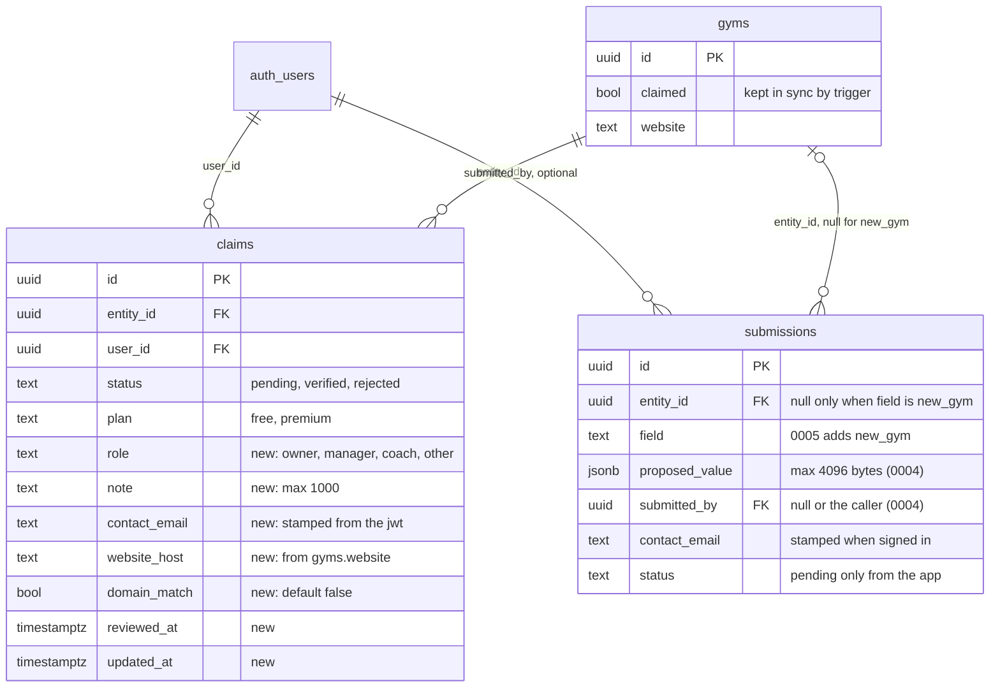
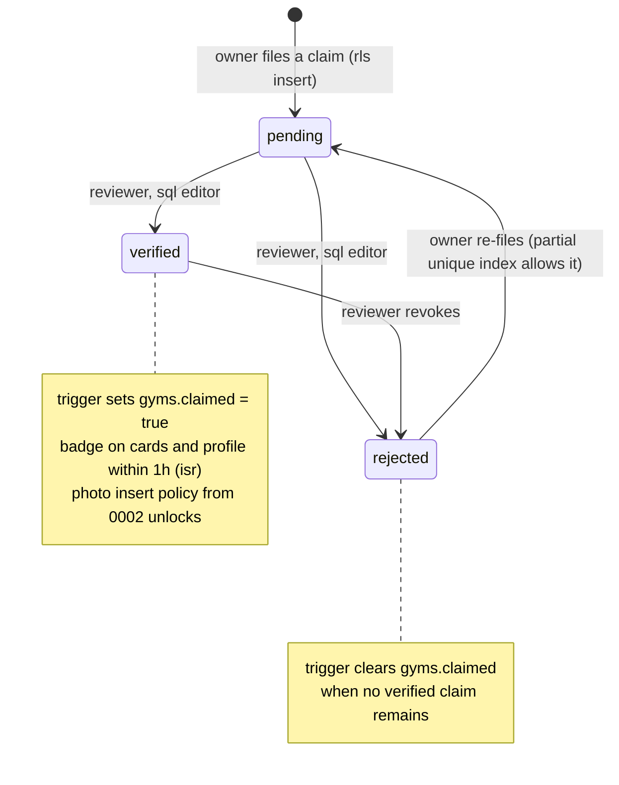
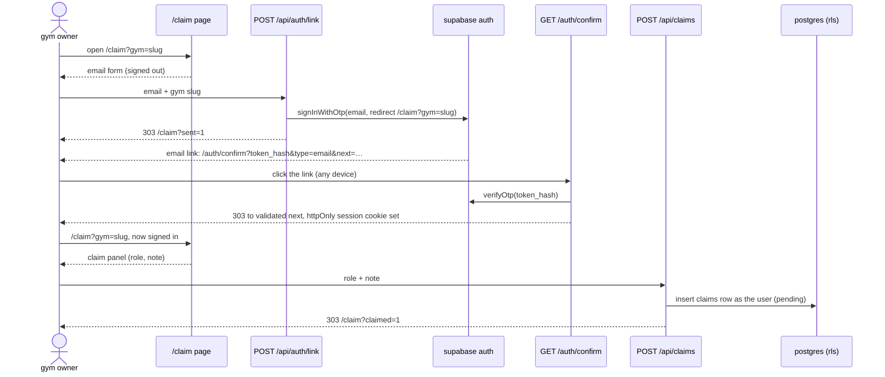
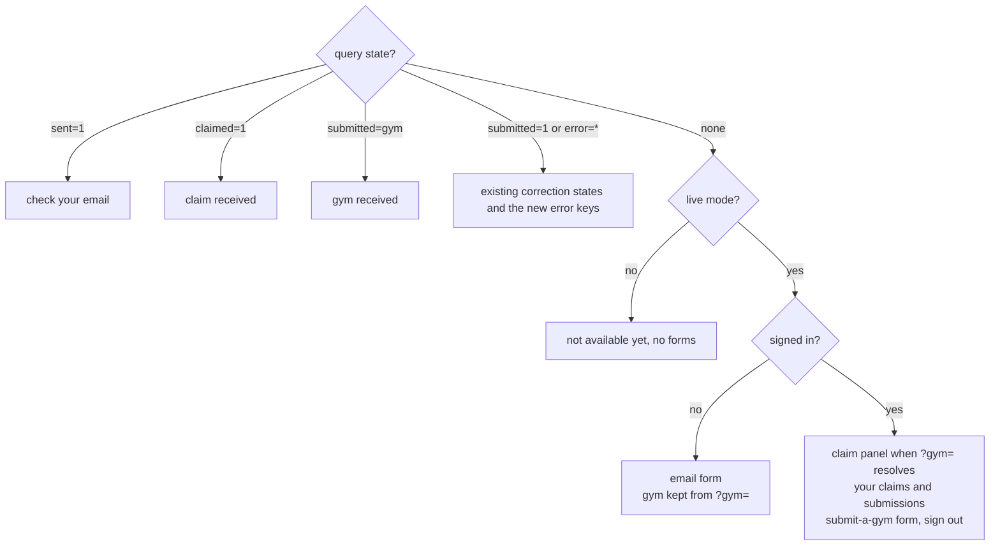
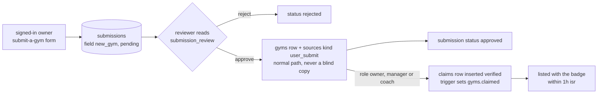

# gym claims and new-gym submissions — design

2026-09-26, diagrams and master rebase 2026-09-27. approved in conversation; implementation plan follows. builds on master after PRs #3 (first-visit experience: `/claim` states, `lib/submissions.ts`, `CorrectionForm`, `POST /api/submissions`), #4 (all-gyms listing) and #5 (analytics, `correction_submitted` event). migration `0004_submissions_policy.sql` is applied live; this design's migration is `0005_claims.sql`.

## intent

the playbook's flywheel: a gym owner claims their listing for free, gets the "✓ claimed" badge once verified, and their corrections carry the gold `gym_claim` tier. someone whose gym is missing can submit it. nothing publishes without review. the metric is claimed listings ("50 claimed dmv gyms by month 2"), not edits.

decisions made in brainstorming:

- v1 = claim + badge + attributed corrections + submit-a-gym. self-serve editing, photo upload ui and premium are later specs.
- verification is manual with a domain-match hint. nothing auto-verifies.
- submitting a new gym requires sign-in, the same magic link.
- cookie sessions (`@supabase/ssr`), plain html forms posting to route handlers with 303 redirects, writes as the signed-in user under hardened rls. no security definer rpc, no service-role key in the web app.

## at a glance

```mermaid
flowchart LR
  B[browser<br/>plain html forms] -->|GET /claim| P[proxy.ts<br/>refreshes the session]
  P --> C[/claim page<br/>server component]
  B -->|POST forms| R[route handlers<br/>auth, claims, submissions]
  R <--> A[(supabase auth<br/>magic link)]
  C --> D[(postgres<br/>rls: pending rows only)]
  R --> D
  V[reviewer<br/>sql editor, as postgres] -->|sets status| D
  D -->|gyms.claimed via trigger| I[static pages<br/>badge within 1h isr]
```

the proxy touches only `/claim`. static directory pages never run auth code. every write from the app is a pending row inserted as the signed-in user; only the reviewer changes status.

## constraints

- no auth exists today: anon key only, `persistSession: false`. the browser key stays the public anon/publishable key.
- supabase's built-in email sender delivers 2 messages per hour and only to project team addresses (docs, 2026-09-26). custom smtp is a launch gate, not a nice-to-have.
- `claims_own` in 0001 is `for all`. once anyone can sign in they can insert `status='verified'` and gain the direct photo-insert rights 0002 grants verified claimants. 0005 closes this regardless of the rest.
- 0004 already bounds `submissions` inserts (pending, allowed fields, sizes, no forged `submitted_by`). 0005 extends it rather than replacing the idea.
- directory pages stay static under 1h isr. auth code never runs on them.
- `LIVE_STYLES` stays muay_thai + kickboxing. submitted mma/bjj gyms are stored, not listed.
- never invent data. a claim or submission changes nothing on the site until the reviewer acts.
- full check stays green. smoke keeps asserting `/claim` has no form and says "not available yet" on an unconfigured build.

## 1. data — migration `0005_claims.sql`



**claims, columns added**

| column | type | set by |
|---|---|---|
| role | text, check in owner / manager / coach / other | form |
| note | text, check length ≤ 1000 | form, optional |
| contact_email | text | trigger, from the jwt email claim; never from the form |
| website_host | text | trigger; gym website host lowercased, `www.` stripped; null without a website |
| domain_match | bool not null default false | trigger; email domain equals website_host |
| reviewed_at, updated_at | timestamptz | trigger on update |

check constraints on `status in ('pending','verified','rejected')` and `plan in ('free','premium')`. unique partial index `claims_open_per_user_gym` on `(entity_type, entity_id, user_id) where status <> 'rejected'`: one open claim per user per gym, a rejected owner can re-file. several people may hold verified claims on one gym.

**claims policies.** drop `claims_own`. add:

- `claims_select_own`: `for select to authenticated using (user_id = (select auth.uid()))`.
- `claims_insert_pending`: `for insert to authenticated with check (user_id = (select auth.uid()) and status = 'pending' and plan = 'free' and entity_type = 'gym' and reviewed_at is null and exists (select 1 from gyms g where g.id = entity_id and g.is_active and not g.is_sample))`.
- no update or delete policy for users. the reviewer changes status in the supabase sql or table editor as postgres, which bypasses rls.

**claim lifecycle**



**claims triggers**, all security invoker with `set search_path = public`:

- `claims_stamp` before insert: when `auth.uid()` is not null, `contact_email := auth.jwt() ->> 'email'` (overrides whatever was sent); `website_host` from the gym's website; `domain_match := website_host is not null and lower(split_part(contact_email, '@', 2)) = website_host`.
- `claims_touch` before update: `updated_at := now()`; when status changes, `reviewed_at := now()`.
- `claims_sync_gym` after insert or update of status, guarded to run only when `new.status = 'verified'` or (`tg_op = 'UPDATE'` and `old.status = 'verified'`): `update gyms set claimed = exists (select 1 from claims c where c.entity_type = 'gym' and c.entity_id = new.entity_id and c.status = 'verified') where id = new.entity_id`. a pending insert never touches gyms.

**submissions.** 0004's `submissions_insert_any` already requires pending status, an allowed field, bounded note, email and payload sizes, and `submitted_by is null or submitted_by = auth.uid()`. 0005 re-creates it with the same body plus:

- `'new_gym'` in the allowed field list.
- `(field <> 'new_gym' or (submitted_by is not null and entity_id is null))`: a new gym needs a signed-in submitter and no entity.
- check constraint `submissions_new_gym_shape`: `(field = 'new_gym') = (entity_id is null)`.
- `submissions_stamp` before insert: the same contact-email stamping when `auth.uid()` is not null.
- `submissions_read_own` unchanged. anonymous corrections keep working exactly as today.

**review views**, `with (security_invoker = true)`, `revoke all on … from anon, authenticated`, for the sql editor only:

- `claim_review`: claims joined to gyms (slug, name, website).
- `submission_review`: submissions plus `from_verified_claimant` (a verified claim by `submitted_by` on `entity_id`) and the gym slug and name when `entity_id` is set.

**unchanged:** `has_verified_claim()` and the photo policies from 0002, `gym_cards`, 0003 and 0004. no new tables, so the 2026-10-30 change to data-api exposure defaults does not apply; a later migration that adds a table the app reads needs explicit grants.

**rollback:** the app reverts, 0005's policies stay. never restore `claims_own`.

## 2. auth



- dependency `@supabase/ssr`, pinned (0.12.7 today; peer supabase-js ^2.114, project has ^2.116). lockfile committed.
- `lib/auth.ts`, server only, never imported by a client component. `serverClient()` = `createServerClient(url, anonKey, { cookies: { getAll, setAll }, cookieOptions: { httpOnly: true, sameSite: 'lax', secure: production } })` over next's async `cookies()`; the package defaults to `httpOnly: false`, hence the explicit option. `setAll` swallows the "cannot set cookies from a server component" error because the proxy handles refresh there. `currentUser()` calls `getClaims()`, which verifies the token instead of trusting the cookie, and returns `{ id, email } | null`; null outside live mode without contacting anything.
- `src/proxy.ts`: `matcher: ['/claim']`. builds a client over request and response cookies, calls `getClaims()` so an expired token refreshes, returns the response `setAll` last built. never redirects or gates. no-op outside live mode. static pages never see it.
- sign-in link: `POST /api/auth/link`, form-encoded `email`, optional `gym` slug, honeypot `website_url`. email regex shared with `lib/submissions.ts`. `signInWithOtp({ email, options: { shouldCreateUser: true, emailRedirectTo: SITE.url + '/claim' + (gym ? '?gym=' + gym : '') } })`. always 303 → `/claim?sent=1[&gym=]` on success and on an unknown address alike, so nobody can probe registrations. a supabase error (typically the 60 s per-address limit) → `/claim?error=link[&gym=]`. honeypot filled → `sent=1` without calling supabase.
- confirm: `GET /auth/confirm?token_hash&type&next`. `type` must be `email`, `magiclink` or `signup`, whatever the templates send. `verifyOtp({ type, token_hash })` through a client bound to the response cookies, so the session lands in the browser here. `next` is accepted only if `new URL(next, SITE.url)` has origin `SITE.url`, pathname `/claim`, and a search that is empty or exactly `?gym=<slug matching /^[a-z0-9-]{1,120}$/>`; anything else falls back to `/claim`. failure → 303 `/claim?error=auth`. no query value is echoed into html. outside live mode → 303 `/claim` with no cookies. because the link carries the gym, reading the email on a phone and clicking there still works.
- sign-out: `POST /api/auth/signout` → `signOut()`, cookies cleared through `setAll`, 303 `/claim`.
- csrf: session cookies are samesite lax, so a cross-site form post carries no session. `POST /api/claims` and `POST /api/submissions/gym` additionally require an `Origin` header whose host equals the request's `Host`; otherwise 403, nothing written.
- limits: supabase's 60 s per address and 30 per hour per project (with custom smtp) are the only email limits. body cap 8 kb like the corrections route.

## 3. write routes

**`POST /api/claims`** (form-encoded): outside live → 503. no session → 303 `/claim?error=signin[&gym=]`. origin check → 403. body: `gym` slug, `role` in owner / manager / coach / other, `note` ≤ 1000 optional, honeypot. `gym` resolves via `getGymCard` (live, non-sample) else `error=notfound`. insert as the user: `{ entity_type: 'gym', entity_id, user_id, role, note, status: 'pending', plan: 'free' }`. unique violation (23505) counts as success. success → 303 `/claim?claimed=1&gym=<slug>`; other insert error → `error=claim&gym=<slug>`. honeypot filled → `claimed=1` without writing. on success, a `claim_submitted` analytics event with no properties beyond `role`, through the same `track` helper the corrections route uses (moved to `lib/analytics.ts` so all three routes share it; `correction_submitted` keeps its shape).

**`POST /api/submissions/gym`** (form-encoded): same live, session and origin checks. `parseNewGym()` in `lib/submissions.ts`, non-string values count as empty:

| field | rule |
|---|---|
| name | 1–160 |
| address | ≤ 240, starts with a street number followed by at least two words (the `public_candidates` regex) |
| city | 1–80 |
| state | two letters, uppercased |
| website | optional, ≤ 500, passes `safeExternalUrl` |
| instagram | optional, 1–30 of `[a-z0-9._]`, leading `@` stripped, lowercased |
| styles | 1–3 distinct values of `Style` |
| role | owner / manager / coach / member / other |
| note | optional, ≤ 1000 |

invalid → 303 `/claim?error=gym&field=<name>`. insert `{ entity_type: 'gym', entity_id: null, field: 'new_gym', proposed_value: <parsed object, well under 0004's 4096-byte cap>, note, submitted_by: user.id, contact_email: user.email, status: 'pending' }`. success → 303 `/claim?submitted=gym` plus a `gym_submitted` event with `{ styles: count }`; insert error → `error=1`.

**`POST /api/submissions`** (existing): after parsing, `const user = await currentUser()`; when present, insert with `submitted_by: user.id` and `contact_email: input.email ?? user.email`. the `correction_submitted` event and everything else stay as they are.

## 4. `/claim` page



dynamic, noindex, never in the sitemap. outside live mode it renders today's "not available" copy with no forms. in live mode, one-off states from the query take precedence, each a short panel with a back link like the existing correction states:

| query | panel |
|---|---|
| `sent=1` | check your email; the link expires in an hour, one per minute |
| `claimed=1&gym=` | claim received, reviewed by hand, the badge appears once verified |
| `submitted=gym` | gym received, reviewed before it is listed |
| `submitted=1`, `error=notfound\|field\|value\|1` | existing correction states |
| `error=link` | could not send a sign-in link; wait a minute and try again |
| `error=auth` | that link is invalid or expired; request a new one |
| `error=signin` | sign in first (shows the email form with the gym kept) |
| `error=claim` | the claim could not be saved; try again |
| `error=gym&field=` | one message per field of the new-gym form |

**signed out:** h1 "Claim {gym name}" when `gym` resolves to a live gym, else "Gym updates". three lines on what claiming gets: free, the badge, corrections marked "confirmed by gym". email form → `/api/auth/link` with hidden slug and honeypot. below: "Gym not listed? Sign in with your email to submit it."

**signed in:** "Signed in as {email}" with a sign-out button. if `gym` resolves and the user has no open claim there, a claim panel with the gym's name and address, a role select, a note textarea → `/api/claims`. if they already claimed it, that claim's status shows instead. then "Your claims" and "Your submissions" (status words: under review, verified, not approved), read through the user's cookie-bound client so rls returns only their rows, then gym names via `gym_cards` for the ids. then the submit-a-gym form (`id="submit"`) → `/api/submissions/gym`: name, street address, city, state, website and instagram (optional), styles as checkboxes across all eight `Style` values with a note that only Muay Thai and kickboxing pages are live today, role, note, honeypot. a closing line: every claim and submission is checked by hand before anything changes on the site.

read errors throw like `checked()` and reach the existing error boundary. a `getClaims` failure is a signed-out view, never an error page.

## 5. touchpoints

- gym page sidebar: a new "Is this your gym?" panel directly above the existing correction form. live and not claimed: "Claim it free to get the verified badge and have your corrections marked as confirmed by the gym." → `/claim?gym=<slug>`. live and claimed: "Claimed by the gym." plus "Staff? Sign in" to the same link. outside live mode the panel is not rendered, mirroring the correction form's `live` gate.
- city page, bottom: "Gym missing? Submit it." → `/claim#submit`.
- footer link text: "Claim or submit a gym" (replaces "Updates (not available yet)"). header "Gym updates" unchanged.
- `gyms.claimed` is set by the reviewer's update, so the badge on cards and profiles follows within the 1h isr window.

## 6. ops — added to `docs/launch-operations.md` as gates



1. custom smtp (resend, postmark or ses) with a findfightgyms.com sender and its dns records. without it no owner can sign in.
2. auth → email provider enabled. templates "Magic link or OTP" and "Confirm sign up" both set to `{{ .SiteURL }}/auth/confirm?token_hash={{ .TokenHash }}&type=email&next={{ .RedirectTo }}`. site url `https://www.findfightgyms.com`, matching production's `NEXT_PUBLIC_SITE_URL`.
3. redirect allow-list: `https://www.findfightgyms.com/claim*` (`*` matches non-separator characters, so `?gym=<slug>` matches and `/claim/x` does not) and `http://localhost:3000/**` for development. keep the same www origin in both auth settings and `NEXT_PUBLIC_SITE_URL` so the sign-in link preserves the selected gym.
4. apply 0005 with `cd scrapers && .venv/bin/python run_sql.py ../supabase/migrations/0005_claims.sql` after the migration test passes. first check `select count(*) from submissions where entity_id is null` is zero; a nonzero count means rows to inspect before the shape constraint can apply.
5. review snippets, run as postgres:
   - claim: `update claims set status = 'verified' where id = '<id>'` (or `'rejected'`). the trigger flips `gyms.claimed`.
   - new gym: read `submission_review`; create the gym through the normal path (manual sql or the candidates importer) with a `sources` row `kind = 'user_submit'` whose `raw` is the submission's `proposed_value`; `update submissions set status = 'approved' where id = '<id>'`; when the role was owner, manager or coach, `insert into claims (entity_type, entity_id, user_id, status, role, contact_email) values ('gym', '<gym id>', '<submitted_by>', 'verified', '<role>', '<contact_email>')`.
   - corrections: `submission_review.from_verified_claimant = true` → enter the value through the normal path with `verified_by = 'gym_claim'`.
6. from 2026-10-30 new tables in `public` are not exposed to the data api by default; grant explicitly when one is added.
7. environment: nothing new. `NEXT_PUBLIC_SITE_URL` already drives `SITE.url`, which the links use, so auth emails always point at production; the claim flow is exercised on production and local development, not on vercel previews. the `claim_submitted` and `gym_submitted` events appear under analytics → events next to `correction_submitted`.

## errors

- posts outside live mode → 503, nothing written. the confirm route outside live mode redirects without setting cookies.
- a failed insert is never a thank-you (existing rule).
- a bad or expired session the proxy could not refresh means signed out, never an error page.
- the only query values reflected into html are the validated gym slug and the fixed error keys.

## tests

- `auth.test.ts`: link route (email validation, honeypot, identical redirect for unknown addresses, `error=link` on a supabase error, 503 offline with no fetch); confirm route (`next` matrix: foreign origin, other path, malformed slug, extra params → `/claim`; bad token → `error=auth`; success sets cookies and redirects to the validated `next`); sign-out clears cookies.
- `claims.test.ts`: session required, origin check, exact insert body, unique violation as success, notfound, honeypot; new-gym parser table, exact insert body with `entity_id: null`; events recorded only on success and only on vercel, like the existing `correction_submitted` guard.
- `submissions.test.ts` (extend): a signed-in correction carries `submitted_by` and falls back to the session email; the existing anonymous body assertion stays byte-identical.
- `routes-live.test.tsx` (extend): every `/claim` state; signed-out form with honeypot; signed-in view lists claims and submissions from stubbed reads; gym sidebar copy in live, claimed, demo and sample cases. the live-profile assertion that forbids `Claim free` copy is retired on purpose, and `not available yet` stays forbidden on live profiles.
- `routes-missing.test.tsx` (extend): `/claim` unconfigured still says "not available yet"; the footer assertion moves from "Updates (not available yet)" to "Claim or submit a gym".
- `proxy.test.ts`: passes through outside live mode; in live mode returns a response without redirecting.
- `migrations.test.ts`: pglite runs 0001–0005 and the seed with stubbed `auth.uid()` and `auth.jwt()` reading a session variable, roles `anon` and `authenticated` created and granted (the harness from the first-visit session), then asserts as `authenticated`: a pending own claim inserts; `status = 'verified'`, another user's id, a sample gym and a second open claim are refused; updates are refused; a `new_gym` submission needs a signed-in submitter and null entity; `submitted_by` cannot be forged; the 0004 field allowlist still rejects unknown fields. as postgres: verifying flips `gyms.claimed` and rejecting the only verified claim clears it; `contact_email` and `domain_match` are stamped. one new devDependency `@electric-sql/pglite`, pinned.
- smoke: `/claim` unconfigured has no form and says "not available yet"; `POST /api/claims` → 503; `GET /auth/confirm?token_hash=x&type=email` → 303 to `/claim` with no `set-cookie`.
- full check stays green: `npm test && npm run typecheck && npm run lint && npm run build && npm run test:smoke`.

## out of scope

self-serve editing of prices, schedule or description; photo upload ui; premium plan or payments; an admin ui; status-change emails to claimants; auto-verification; captcha; mma and bjj pages; deleting anything.

## assumptions

- the supabase auth email provider can be enabled on the project and custom smtp will be configured before launch. unverified from this session, which has no dashboard access.
- `getClaims()` verifies locally against the project's signing keys or falls back to `getUser()`; tests stub either transport and never contact a real project.
- the reviewer works in the supabase sql or table editor as postgres, so status updates bypass rls and the sync trigger's `update gyms` succeeds.
- volume stays low enough for manual review. the unique index, the honeypot and supabase's email limits are the only abuse controls.

## open risks

- `proxy.ts` is the first request-time code on a public path. it is scoped to `/claim`, and a bug there cannot reach the static pages, but it runs for every `/claim` hit.
- the corrections route's `submitted_by` attribution depends on the browser sending the session cookie to `/api/submissions`, which samesite lax allows for same-site posts. a cross-site post would file an anonymous correction, which is the correct degradation.
- the live `submissions` table already holds one rejected launch-check row; the shape constraint applies as long as its `entity_id` is set, which the ops step checks first.
